

<!-- _class: lead -->

# 🔴 ThinkPads

#### Geschichte und Nerdkultur

 

Christian ~~Nostalgowic~~ Stankowic
FrOSCon 2024
18.08.2024

---

<!-- _header: `whoami` -->

- Christian Stankowic
- [@stdevel@chaos.social](https://chaos.social/@stdevel) üêò
- IT-Berater und -Trainer 👨🏻‍🏫
- sammelt obsolete Hardware
- Blogger ([cstan.io](https://cstan.io) üìñ)
- Podcaster 🎙️
  - [FOCUS ON: Linux](https://focusonlinux.podigee.io) üêß
  - [Faxinformatiker](https://faxinformatiker.de) 📠
  - [ThinkPad-Museum](https://thinkpad-museum.de/episode) 💻

---

<!-- _header: Agenda -->

1. Motivation
1. Geschichte
1. Wichtige Serien, Modelle und Kuriositäten
1. Pop- und Nerdkultur

---

<!-- _header: Motivation -->

- in Business- und Hacker:innen-Kreisen häufig anzutreffen
- prägten seit der Einführung **1992** den Notebook-Markt
- Marke hat sich immer verändert, die Wurzeln sind jedoch noch immer erkennbar
- stehen nach wie vor für **robuste** und langlebige Geräte

- sah Anfang der 2000er einen Vertreterkoffer mit T23 und **Drucker**
- **zeitloses** Design und Praktikabilität haben mich begeistert
- seither ThinkPads als Daily Driver
- in einem Corona-Lockdown angefangen ThinkPads zu sammeln

---

<!-- _header: Zeitloses Design, das heute noch erkennbar ist -->

IBM ThinkPad T23 (2001)

Lenovo ThinkPad T470p (2017)

<!--

- Clamshell-Design entfällt bei Lenovo
- blauer Farbton entfällt
- rote Akzente bei TrackPoint und TrackPad bestehen weitehrin
- schräges Logo ist weiterhin eine Marke

-->

---

<!-- _header: ThinkPad-Museum -->

- Online-Museum als **Blog**
- listet Details der Sammlung auf
  - **54** Notebooks
  - **3** PDAs
  - **7** Docking Stationen
- **WIP**: Bilder-Galerien und ergänzende Artikelserien
- monatlicher **Podcast**
- 🔴 [thinkpad-museum.de](https://thinkpad-museum.de)

---

<!-- _header: ThinkPad-Museum -->

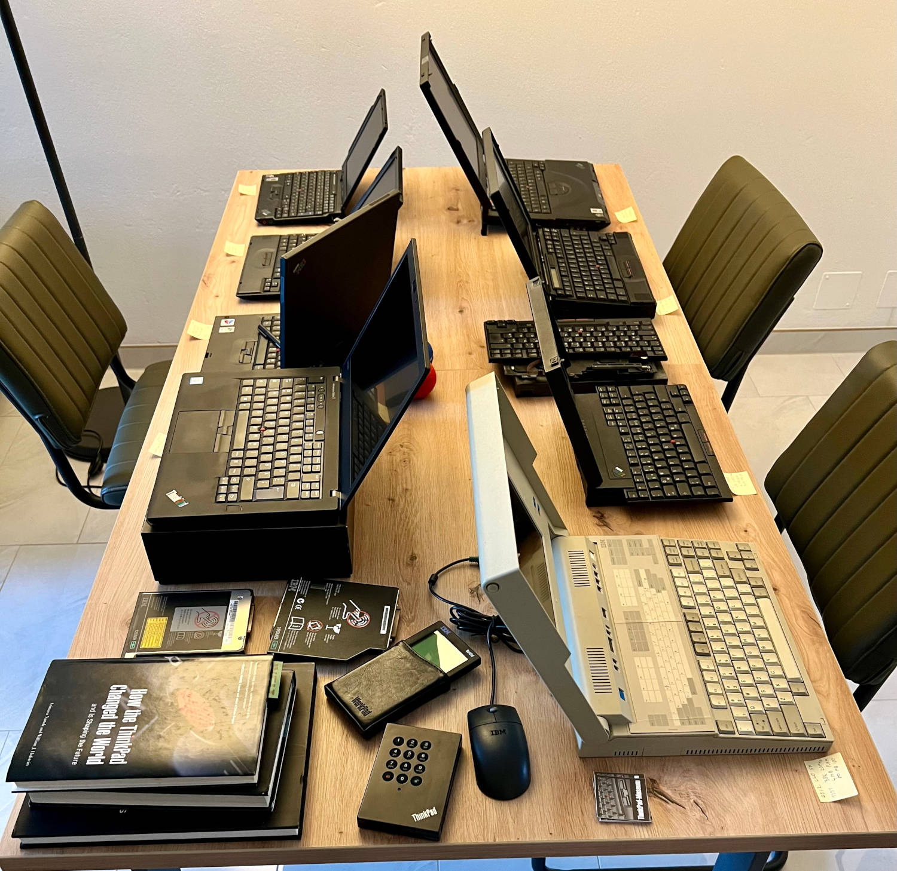

Teil der Sammlung

Transport der Sammlung

---

<!-- _header: Ready? -->

---

<!-- _header: IBM - ein Kurzprofil -->

- geht auf **Tabulating Machine Company** zurück
  - **1986** von **Herman Hollerith** gegründet
  - Erfinder des Hollerith-**Lochkartenverfahrens**
  - speziell für USA-Volkszählung 1890 entwickelt

- **1911** als **Computing-Tabulating-Recording Company (CTR**) gegründet
- kombinierte drei Unternehmen
    - **C**omputing Scale Corporation
    - **T**abulating Machine Company (Hollerith)
    - International Time **R**ecording

<!--
- Tabelliermaschinen können im Heinz Nixdorf Museum in Paderborn begutachtet werden
- 113 Jahre bewegte Firmengeschichte
  - von Lochkarten und Stechuhren über Röhrenrechner, Mainframes bishin zu Personal Computer und Quantencomputer
-->

---

<!-- _header: IBM - ein Kurzprofil -->

- CTR beschäftigte **1.300 Mitarbeitende** und spezialisierte sich auf Lochkarten, Waagen und Uhren
- **1924** wurde CTR in **International Business Machines** umbenannt
- Fokus auf Unternehmen
  - Lochkartensortierer/-locher und Tabelliermaschinen
  - Lochkarten-**Monopol**

<!--
- Stimmzettel-Zählungen eingestellt, weil die Hersteller für nicht gezählte Stimmen haftbar gemacht wurden
-->

---

<!-- _header: Thomas J. Watson Sr. -->

- leitete CTR und IBM zwischen 1914 und 1955
- wurde oft als *der weltbeste Verkäufer* bezeichnet
- sprach von "*systematischem Ausschalten der Konkurrenz*"

- prägte die IBM-**Kultur**
  - Starker Fokus auf Vertrieb und **Loyalität**
  - Prämien für Verkäufe und Verbesserungsideen
  - Dresscode, striktes Alkoholverbot (*auch privat*)
  - **Firmenhymne** und Liederbuch

<!--

- ob es damals schon Obstkörbe in den Büros gab?

-->

---

<!-- _header: Trivia: THINK -->

- 1911 benutzte Watson erstmalig den Slogan

> The trouble with every one of us is that we don't think enough. We don't get paid for working with our feet - we get paid for working with our heads.

- Bedeutung bewusst vage gehalten, wollte zu **proaktivem Handeln** motivieren
- Interne Zeitschrift wurde in **THINK** umbenannt, Mitarbeitende erhalten **Notizbuch** bei Einstieg
- zierte später Büros und Mainframes
- wurde zur **Marke**: *ThinkPad*, *ThinkCentre*, *ThinkVision*,...
- [IBMs Business-Konferenz](https://www.ibm.com/events/think) heißt ebenfalls Think

---

<!-- _header: IBM - ein Kurzprofil -->

Urmodell des IBM PCs
(1981, Model 5150)

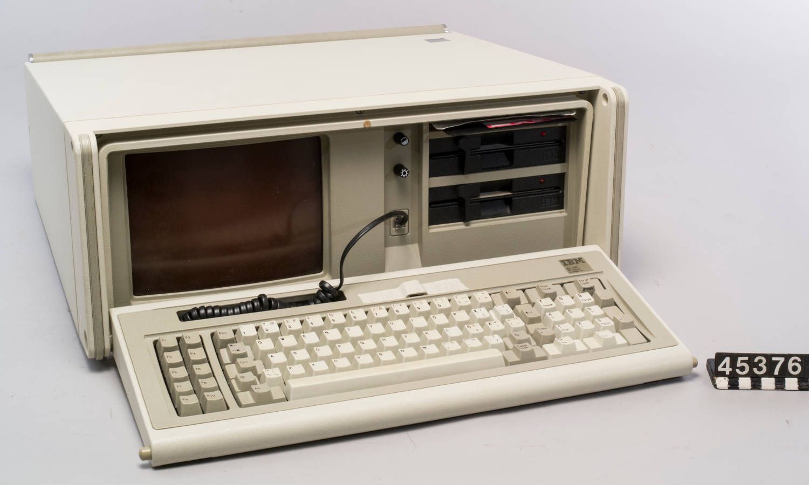

Erster tragbarer Computer
(1984, Model 5155)

<!--

- Model 5150
  - Intel 8088 mit 4,77 MHz
  - bis zu 256 kB RAM
  - 2x Floppy
- Model 5155
  - Intel 8088 mit 4,77 MHz
  - 256 - 640 KB RAM
  - 2x Floppy, optionale Festplatte später
  - CGA-Grafik, monochrom

-->

---

<!-- _header: IBM - ein Kurzprofil -->

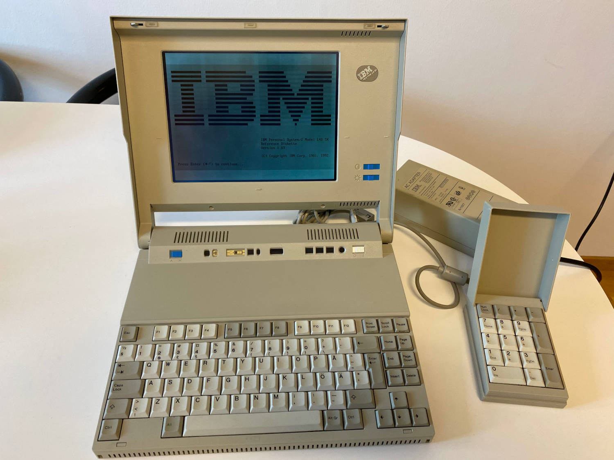

Erster Laptop
(1991, PS/2 Model L40 SX)

Erstes ThinkPad
(1992, ThinkPad 700)

<!--

- Model 5150
  - Intel 8088 mit 4,77 MHz
  - bis zu 256 kB RAM
  - 2x Floppy
- Model 5155
  - Intel 8088 mit 4,77 MHz
  - 256 - 640 KB RAM
  - 2x Floppy, optionale Festplatte später
  - CGA-Grafik, monochrom

-->

---

<!-- _header: Wichtige Personen im ThinkPad-Kosmos -->

- **Arimasa Naitoh**
  - Father of ThinkPad
  - japanischer Ingenieur
- **Richard Sapper**
  - seit 1979 leitender Designberater bei IBM
- David Hill
  - ThinkPad-Designchef
- **Dr. Ted Selker**
  - Erfinder des **TrackPoints**

- Tom Hardy
  - IBM-Industriedesigner
- George Karidis
  - Designer des **TrackWrite Keyboards**
  - auch als **Butterfly Keyboard** bekannt
- **Mark Pearson**
  - pflegt Linux-Support

---

<!-- _header: Trivia: Unterschiedliche TrackPoint-Typen -->
<!-- footer: Quelle: [Reddit](https://www.reddit.com/r/thinkpad/comments/h16v1f/tizio_and_thinkpad_the_perfect_classical/#lightbox) -->

<!--

- wurden die Jahre über immer optimiert
- wurden kleiner, da die Geräte auch kleiner werden
- billiger Replicas erkennt man daran, dass sie schnell **speckig** werden

-->

---

<!-- _header: Richard Sapper -->
<!-- footer: '' -->

- deutscher Industriedesigner (1932 - 2015†)
- wuchs in Guatemala und Deutschland auf, wanderte nach **Mailand** aus
- einer der wichtigsten Produktdesigner der zweiten Hälfe des 20.Jahrhunderts
- bekannt für zahlreiche innovative Designs, u.a.
  - Artemide Tizio-Tischlampe
  - Lorenz Static-Tischuhr
  - Alessi-Küchengeräte
  - ...

---

<!-- _header: Richard Sapper -->

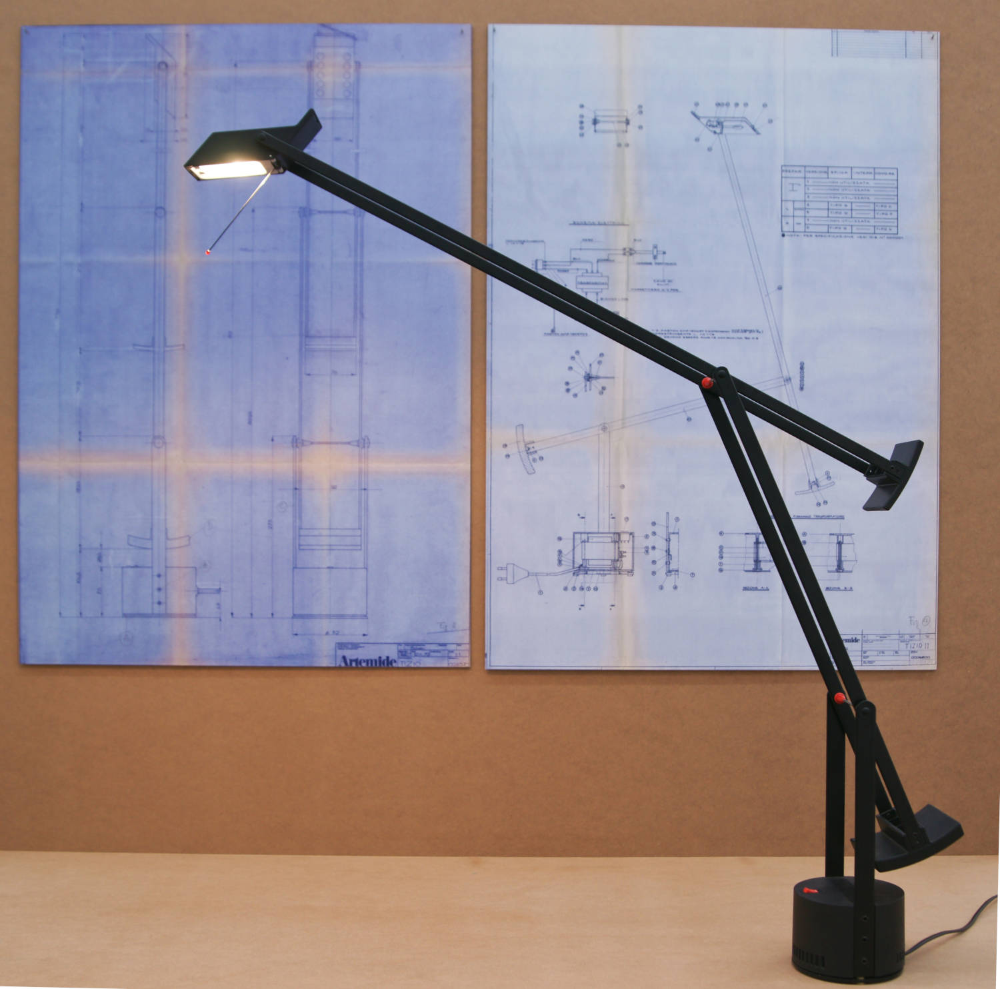

Artemide Tizio und Lorenz Static

<!--

- Lorenz Static (1960)
- Artemide Tizio (1972)

-->

---

<!--
footer: Quelle: [Reddit](https://www.reddit.com/r/thinkpad/comments/h16v1f/tizio_and_thinkpad_the_perfect_classical/#lightbox)
-->

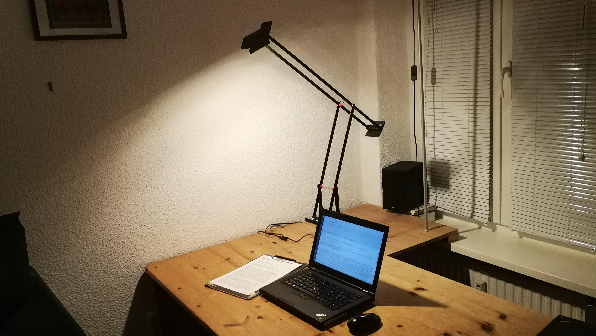

<!--

- Artemide Tizio 50 + ThinkPad T430

-->

---

<!--
_header: Richard Sapper
footer: ''
-->

- ab 1979 **leitender Designberater** bei IBM
- prägte und vereinheitlichte IBM-Designs:
    - **Personality Study** definierte Leergehäuse, in die u.a. Computer gebaut werden konnten
    - **schwarze** Farbe bei ThinkPads
    - **roter** TrackPoint

---

<!-- _header: IBM PC Convertible Model 5140 (1986) -->

- in Boca Raton (Florida) produziert
- dort gibt es eine Alligator-Plage
- Design greift das auf
  - Tastatur = Zähne
  - Öffnungsknopf = Auge
  - Drucker = Schwanz
- erfordert seitliche Betrachtung...

---

<!-- _header: IBM PC Convertible Model 5140 (1986) -->

---

<!-- _header: Trivia: Beige und schwarze ThinkPads -->

- frühere IBM-Geräte hatten eine **beige** Farbe
  - z.B. IBM PC, Convertible, PS/2 Model L40 SX,...
  - einfach und kostengünstig zu produzieren
- Sapper hasste Design und Farbe
  - *"hässliche, dumme, langweilige Box"*
- einige frühe Geräte gab es sowohl in beige als auch **schwarz**
  - beige für den *Einzelhandel*, schwarz für *Geschäftskund:innen*

- Gerüchte über eine deutsche **Arbeitsplatznorm** in den 70ern
  - schrieb Kontast und **Lichtwerte** für Bürocomputer vor
  - wurde von anderen EU-Ländern übernommen

<!--
- schwarz + beige: 700, 720, 750

-->

---

<!-- _header: Trivia: Beige und schwarze ThinkPads -->

- IBM Deutschland sprach sich daher gegen schwarz aus
- man dachte über **kieselgraue** Geräte nach, verwarf die Idee aber
- Regelung lockerte sich später, sofern Handbuch-Hinweis existiert
  - *"Dieses Produkt ist nicht für den Bürogebrauch bestimmt"*

- Sapper wollte schwarze Gehäuse
  - Unterschied zur Konkurrenz, **mystisches** Erscheinungsbild
  - besserer **Kontrast** der frühen Farbdisplays
- beendete Debatte geschickt
  - ließ IBM-Chairman **John Akers** zwischen zwei Entwürfen wählen
  - dieser wählte schwarz, Sapper machte sich in Boca Raton unbeliebt

<!--

- Umfrage ergab
  - Kund:innen kauften ThinkPads zu einem Drittel wegen des Designs

-->

---

<!-- _header: Trivia: Rote Kontrastfarbe -->

- Sapper nutzt rot gerne als Kontrastfarbe
  - **Interaktionsflächen** können einfacher erkannt werden
  - emotionale Konnotation
- stritt sich lange mit IBMs Corporate Identity-Abteilung
  - gaben an, rot sei für den **Not-Aus** der Mainframes reserviert
  - wollten keine anderweitige Nutzung

- Sappers designte daraufhin ein **magenta-farbenes** TrackPoint
  - passte die Farbe iterativ an, ohne den Farbcode (**TP333**) zu ändern
  - IBM bemerkte die Änderungen nicht vor der Produktion
  - Farbe kam gut an, wurde mit edlen Sportwagen verglichen

---

<!-- _header: Ready for the next layer? -->

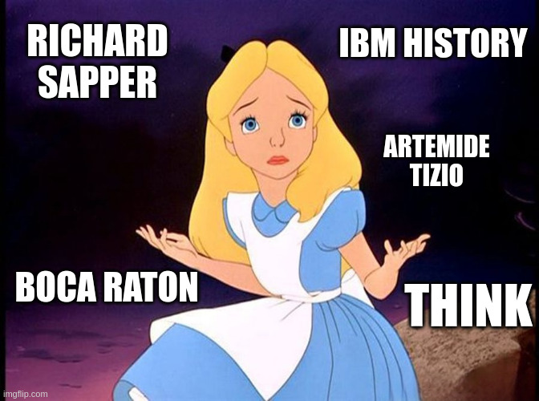

---

<!-- _header: Modellserien von 1991 bis 1999 -->

| Serie | Beschreibung |
| ----- | ------------ |
| 200 | Besonders kompakte Subnotebooks, bis 10.4" |
| 300 | Einstiegsmodelle, exakt **DIN A4** groß |
| 500 | Ultraportable Geräte ohne Floppy/CD |
| 600 / 700 | Oberklasse, hochwertig und stabil |
| 800 | Modelle mit IBM PowerPC-CPU |
| 1000 | **i Series**, von **Acer** produzierte Prosumer-Geräte |

- dreistellige Nummer, an BMW-Modelle angelehnt
- Produktionsreihenfolge geht **nicht** aus Nummerierung heraus
  - 345 erschien z.B. nach 350

---

<!-- _header: Modellserien von 1991 bis 1999 -->

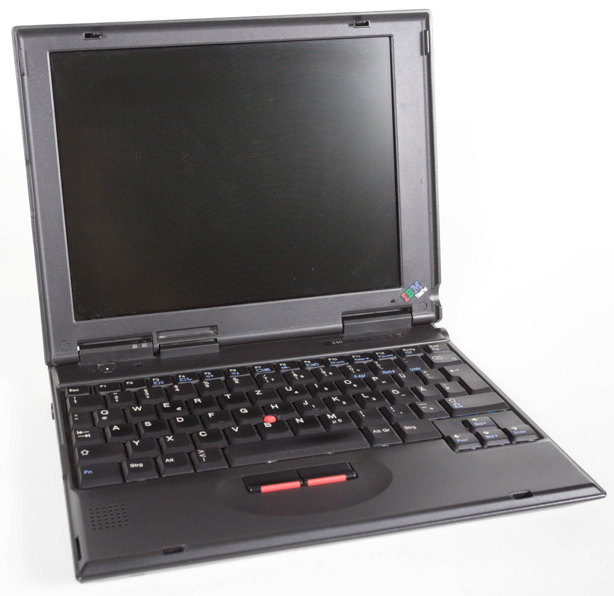

ThinkPad 240

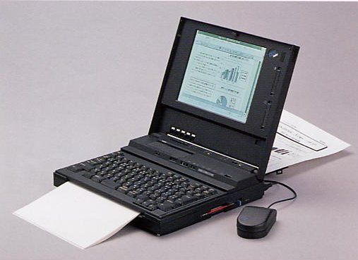

ThinkPad 550BJ mit Drucker

<!--

- 550BJ
  - Intel 486er
  - Monochromes STN-Display
  - Bubble Jet-Drucker
  - Colabo zwischen IBM Japan und Canon

-->

---

<!-- _header: Details des 760EL (1996) -->

Modularer Aufbau

Tastatur wird beim Öffnen angehoben

---

<!-- _header: Modellserien von 1991 bis 1999 -->

TrackWrite-Keyboard des 701C

ThinkPad 820 (1995)

<!--

- 701c
  - Tastatur klappt sich beim Öffnen diagonal aus
  - sehr ausgeklügelter Mechanismus
  - Benchmark war: angenehmes Tippen auf dem knappen Tisch eines Flugzeugs
  - erschien leider zu spät, war technisch dann bereits veraltet
    - 486 statt Pentium 1
  - begehrtes Sammlerobjekt
- 800, 820, 850
  - eins der seltensten ThinkPads überhaupt
  - 3 PowerPC-ThinkPads von 1995 bis 1997 produziert
  - IBMs Antwort auf den Trend von UNIX-Workstations?
    - SCSI-Laufwerk
  - Support für IBM AIX und Windows NT
    - läuft natürlich auch mit Linux und BSD

-->

---

<!-- _header: Trivia: ThinkPad als Mainframe-Konsole -->

- Mainframes haben mehrere **HMCs**
  - dienen u.a. zum Starten und Steuern
- werden i.d.R. selten benutzt
  - Debugging, Troubleshooting

- lange dienten **ThinkPads** als HMC
- beliebte Sammler-Objekte
  - optischer Bestzustand
  - i.d.R. fehlen WLAN und Modem

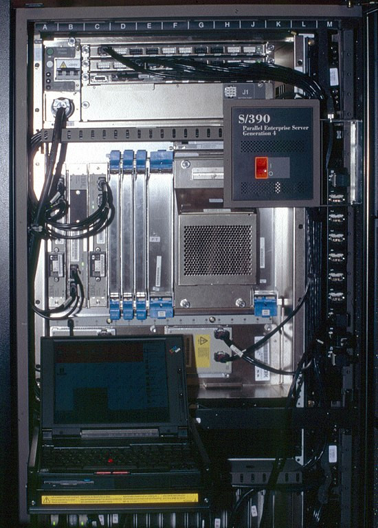

<!--
footer: HMC = **H**ardware **M**anagement **C**onsole
-->

---

<!-- _header: Trivia: ThinkPad als Mainframe-Konsole -->
<!--
footer: ''
-->

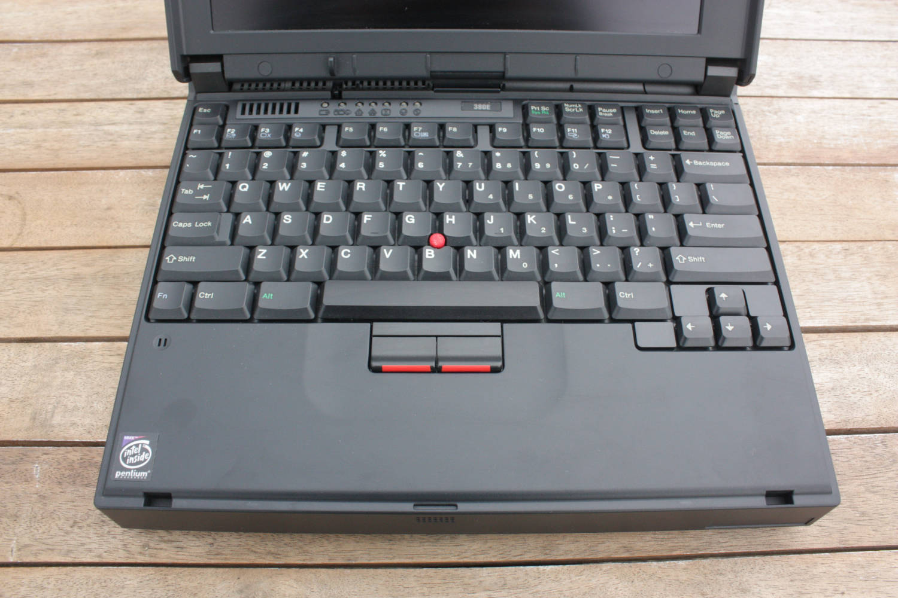

ThinkPad 380E (1998)

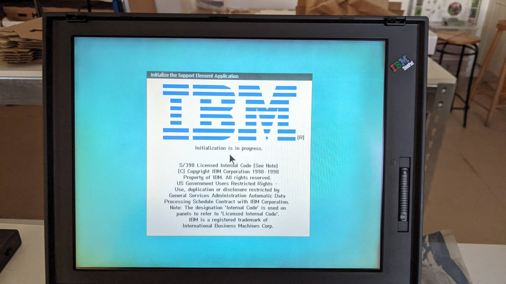

IBM OS/2 mit Management-Anwendung

---

<!-- _header: Modellserien von 1999 bis 2008 -->

| Serie | Beschreibung |
| ----- | ------------ |
| T | Bekannteste Serie, ging aus 600/700 hervor |
| A | Schwere Desktop-Replacements, ging aus 300 hervor |
| R | günstiger als T-Serie, Kunststoff statt Gummierung |
| G | Günstige Desktop-Replacements, von **Acer** gefertigt |
| Z | kurz produzierte Multimedia-Serie, Widescreen-Tests |
| X | Ultraportables und Convertibles, ging aus 200/500 hervor |
| S | besonders kleine Ultaportables mit 10.4", **Asia-only** |

<!--

- Beschränkung auf Serien-Buchstaben und zweistellige Nummer beginnend mit **20**
  - auch diese gibt keinen Rückschluss auf den Produktionszeitraum
  - X32 erschien z.B. nach dem X40

-->

---

<!-- _header: Modellserien von 1999 bis 2008 -->

X40 in UltraBay (2004)

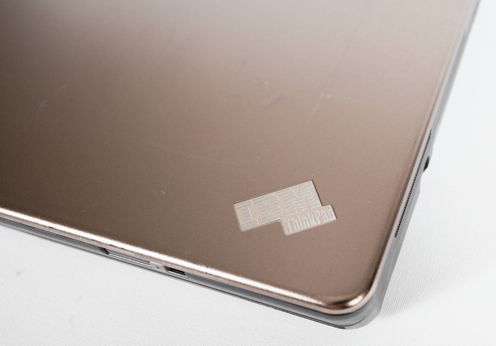

Z61m mit Titanium-Cover (2006)

<!--

- Z61m
  - Titanium-Cover wiegt zusätzliche **400g**!

-->

---

<!-- _header: Modellserien von 1999 bis 2008 -->

CD-Player im i-Series 1500

Japanische Tastatur eines S30

---

<!-- _header: Modellserien von 1999 bis 2008 -->

Schräge Gehäuseform des G40

<!--

- es gab nur drei G-ThinkPads (G40, G41 und G50)
  - G40 hat einen **Desktop** (!!!) Pentium 4
- mit Acer co-produziert
- als günstige Office-Maschine konzipiert
- eingestellt, weil es zu wenig Unterschiede zu anderen Serien gab

-->

---

<!-- _header: UltraBay -->

- wechselbarer Laufwerksschacht
  - 1993 - 2014
- kann i.d.R. im laufenden Betrieb gewechselt werden
- für eine Vielzahl an **Modulen**
  - Disketten und LS-/ZIP-Laufwerke
  - optische Laufwerke
  - zusätzlicher **Akku**
  - weitere Festplatte
  - RS232-/LPT-Adapter

R50 mit UltraBay-Laufwerk

<!--

- in Berufsschule gesichtet: **T61p** mit drei Akkus
  - an der Hinterseite angebrachter
  - UltraBay
  - Unterschnall-Akku 

-->

---

<!-- _header: UltraBay -->

Numpad (22P7330)

Serial and Parallel Port Adapter (40Y8121)

--- 

<!-- _header: Trivia: UltraPort -->

- proprietärer USB 1.1-Anschluss an der Bildschirmoberseite
- rüstete optionale **Module** nach
  - Bluetooth und Infrarot Adapter
  - Webcam, Mikrofon
  - CompactFlash-Kartenleser
- kurzzeitig zwischen **2000** und **2003** verbaut
  - A2x und A3x
  - T2x
  - X2x

UltraPort an einem X21

---

<!-- _header: Trivia: UltraPort -->

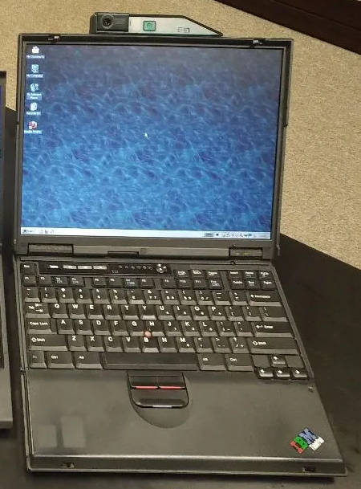

T23 mit Webcam

Mikrofon auf Ständer

CF-Kartenleser

<!--

- wie der CF-Leser wohl auf dem Bildschirm montiert aussieht?
- vielleicht inspirierte das ja Apple zur "Dynamic Island"... 🤡

-->

---

<!-- _header: Fernab von Notebooks: IBM WorkPad -->

- zwischen **1997** und **2001** angeboten
- 9 umgelabelte **Palm** PDAs
- technisch unverändert, lediglich andere Gehäusefarbe und Logo
- **UltraBay**-Docking Station
- wegen zu geringem Interesse eingestellt
- Shout-Out: [In ❤️ with PDA](https://inlovewithpda.de/)

IBM WorkPad (1997)

---

<!-- _header: Fernab von Notebooks: IBM WorkPad -->

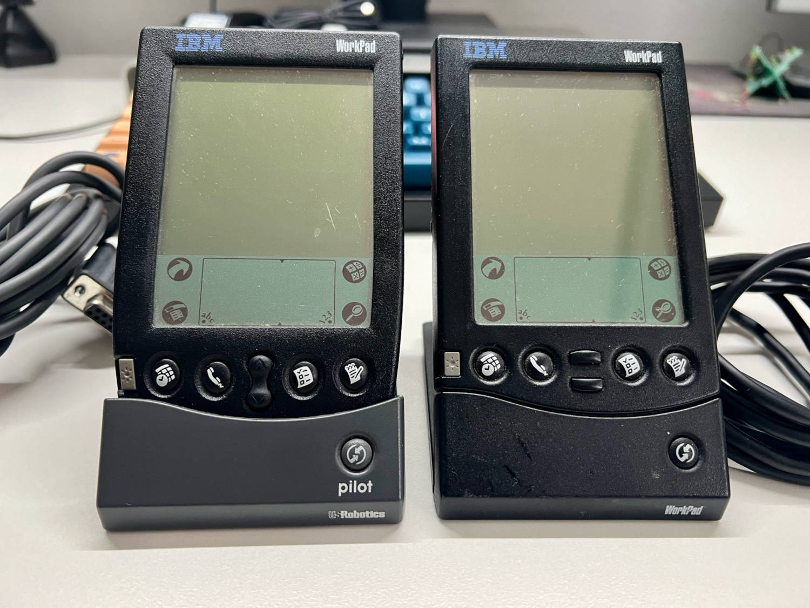

IBM WorkPad und WorkPad 20X

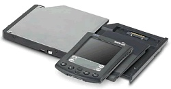

Ultrabay Plus WorkPad c500 Cradle (27P5738)

---

<!-- _header: Modellserien von 2008 - 2016 -->

- Modellbezeichnung nach dem Buchstaben nun dreistellig
- beinhaltet nun auch die **Bildschirmgröße** (*erste Ziffer nach dem Buchstaben*):
  - T400 = 14.1"-Zoll
  - T500 = 15.4"-Zoll
- die nächsten beiden Ziffern stehen nun für die **Generation**:
  - T400, T410, T420,...
- erste Generation die komplett von Lenovo gestaltet wurde
- **Displayhaken** werden wegrationalisiert
- neues **Precision Keyboard**

<!--

- bei der vorherigen Generation stammten einige Geräte noch aus der Feder von IBM (*z.B. X41*) bzw. wurden von Lenovo und IBM produziert (*z.B. T60*)

-->

---

<!-- _header: Klassische 7-Row (T400) und Precision Keyboard (T470p) -->

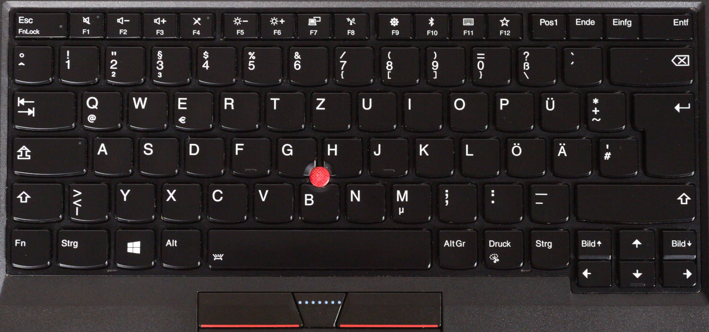

<!--

- größere Tasten
- mehr Freiräume zwischen den Tasten
- 6 statt 7 Reihen
- keine blauen Kontraste mehr
- Sondertasten werden durch **Tastenkombinationen** ersetzt

-->

---

<!-- _header: Modellserien von 2008 - 2016 -->

Änderungen gegenüber früheren Serien:

| Serie | Beschreibung |
| ----- | ------------ |
| L | Ersetzt die R-Serie, Consumer-BIOS |
| E | Neue günstigste Serie, qualitativ unterhalb L-Serie |
| X | 12.1", 12.5" und 13.3", auch Convertible Tablets |
| X1 | 14"-UltraBooks und Converible Tablets (**Yoga**) |
| W | Zertifizierte Workstations, ersetzt Axxp- und Txxp-Modelle |

---

<!-- _header: Modellserien von 2008 - 2016 -->

X300 als "MacBook Air"-Killer

W701ds mit 2 Bildschirmen

---

<!-- _header: Modellserien seit 2016 -->

| Serie | Beschreibung |
| ----- | ------------ |
| T | 14-16", optional nun auch **AMD** sowie **ARM** (T14s G6) |
| X | Wird zugunsten der X1-Serie eingestellt |
| X1 | UltraBooks und testweise ein Ultraportable (X1 Nano) |
| X13 | 13"-Geräte - **X13s** ist das erste ARM-Gerät |
| P | Workstations mit neuen Gehäusen, ersetzt W-Serie |
| Z | modernes Design, dünne Displayränder, **AMD-only** |

- einfacheres Schema ab 2020
  - Ziffern stehen für Displaygröße (*z.B. T14 -> 14"*)
  - anschließend folgt die Generation als eigenes Wort (*z.B. Gen 2*)

<!--

- P passt zu den **ThinkStation P Series**-Geräten

-->

---

<!-- _header: Modellserien seit 2016 -->

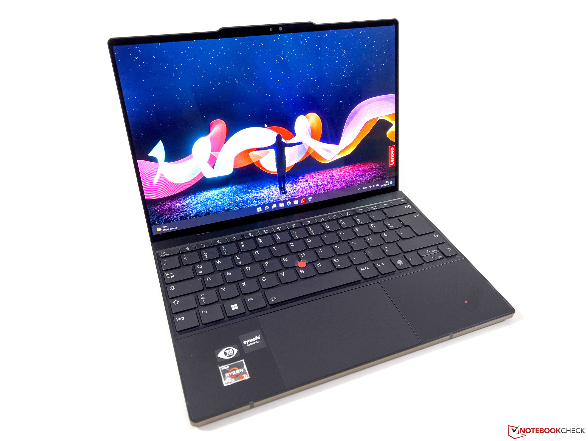

Z13 G2 (2024)

X1 Nano (2021)

<!--

- Z13
  - verzichtet auf zusätzliche Tasten im TouchPad
  - sehr dünne Displayränder
  - Kamera steht hervor und dient auch zur Öffnung
- X1 Nano
  - wiegt unter 1 kg
  - Magnesium + Kohlefaser
  - sehr kompakt robust

-->

---

<!-- _header: Trivia: Jubiläumsmodelle -->

Für einige der Jubiläen wurden besondere Modelle veröffentlicht:

- [ThinkPad Reserve Edition](https://thinkwiki.de/X61#ThinkPad_Reserve_Edition)
  - zum 15. Jubiläum
  - in Lederhülle eingelassenes X61s mit Exklusiv-Service
  - Kosten: **5.000 USD**
* [ThinkPad X1 Carbon G10 30th Anniversary](https://www.notebookcheck.com/Test-Lenovo-ThinkPad-X1-Carbon-G10-30th-Anniversary-Laptop-OLED-Edition-mit-Ausdauer-Problem.673951.0.html)
  - spezielles X1C G10 mit OLED-Display
  - besonderes Logo mit klassischen IBM-Farben
  - auf 5.000 limitert
  - Kosten: **2.500 EUR**

---

<!-- _header: Trivia: Jubiläumsmodelle -->

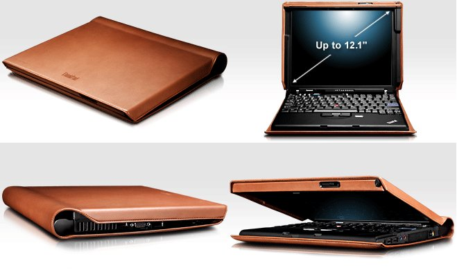

Reserve Edition (2007)

X1C G10 30th (2022)

---

<!-- _header: ThinkPad T25 Anniversary Edition -->

- 2017 zum 25.Jubiläum veröffentlicht
- basiert auf dem **T470**
- klassische **7-Row Tastatur**
- Glas-Touchpad
- Logo in klassischen IBM-Farben
- auf ca. 1.000 limitert, 300 für Deutschland

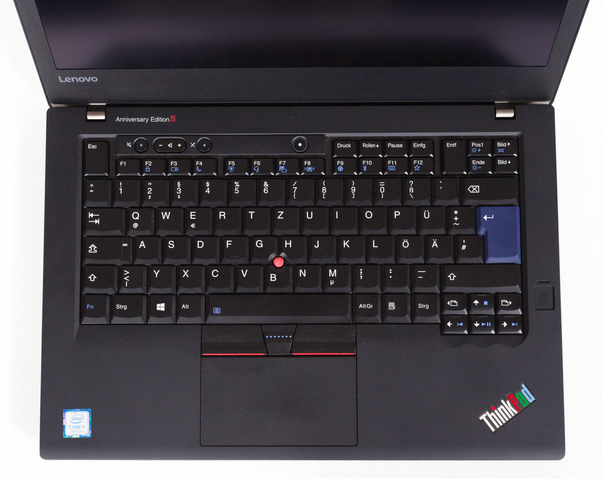

---

<!-- _header: ThinkPad T25 Anniversary Edition -->

---

<!-- _header: Pop- und Nerdkultur -->
<!-- footer: 'CRU = **C**ustomer **R**eplaceable **U**nit; HMM = **H**ardware **M**aintenance **M**anual' -->

- im Business-Umfeld wegen **Qualität** beliebt
  - Reparierbarkeit hat durch dünnere Geräte etwas abgenommen
  - viele Komponenten können vom User gewartet werden (**CRU**)
    - Tastatur, SSD, RAM,...
    - neuer **LPCAMM2**-RAM ermöglicht dünne Module und hohe Geschwindigkeit
  - Wartungshandbücher frei verfügbar (**HMM**)

- Bei Hacker:innen vor allem wegen gutem **Linux-Support** beliebt
  - IBM sah schon früh den Mehrwert darin
  - trifft vor allem auf  T-, P- und X-Geräte zu
  - [Vortrag von **Mark Pearson** über Linux-Support (DebConf 22)](https://debconf22.debconf.org/talks/10-lenovo-linux-2022/)

<!--

- Lenovo setzt sich zusammen mit Dell und anderen Herstellern gegen verlöteten RAM ein

-->

---

<!-- _header: Pop- und Nerdkultur -->
<!-- footer: '' -->

- **Framework**-Notebooks sind inzwischen auch verbreitet
  - Kritik an zwischenzeitlich verlötetem RAM
  - Sperren für manche Komponenten (*z.B. WLAN*)
  - Tastaturen leider kein Alleinstellungsmerkmal mehr wie früher

- Sticker-Trend bei Notebook-Deckeln
  - siehe auch [DevLids](https://www.devlids.com/)
- **Memetische Relevanz**

<!--

- WLAN Kartensperre aufgrund von Export- und Frequenzbeschränkungen

-->

---

<!-- _header: Memetische Relevanz -->

---

<!-- _header: Memetische Relevanz -->
<!-- footer: Quelle: [Reddit](https://www.reddit.com/r/thinkpad/comments/112wxih/custom_boot_screen_on_my_p1_gen4/) -->

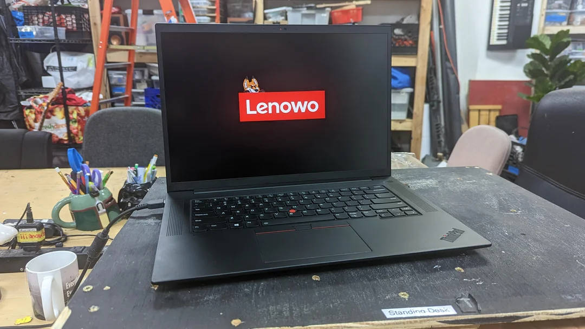

---

<!-- _header: ThinkPad-Mods aus der Maker-Szene -->
<!-- footer: '' -->

Es gibt zahlreiche Community-Mods, die die Geräte erweitern:

- USB-C PD-Mods, z.B. [für T41/T43](https://kittenlabs.de/projects/usb-c-mods/t41-usb-c/)
- [BIOS-Mods](https://www.thinkwiki.org/wiki/Custom_BIOS)
  - z.B. um Limitierungen zu entfernen
  - [Libreboot](https://libreboot.org) und [Coreboot](https://www.coreboot.org/)
- [NVMe BIOS Boot Option](https://kittenlabs.de/nvmeboot/)

- [Frankenpads](https://thinkwiki.de/Frankenpad)
  - stark angepasste ThinkPads, mit neueren Komponenten, etc.
- 51nb-Mods mit komplett überarbeiteten Mainboards
  - [X62 (X61)](https://www.notebookcheck.com/Test-Lenovo-IBM-Thinkpad-51nb-X62-Custom-Laptop.212686.0.html), [X210 (X200/201)](http://www.cnmod.cn/x210/), [X330 (X230)](https://www.xyte.ch/mods/x230/), [T700 (T60/61)](https://www.xyte.ch/t700-crowdfunding/)

<!--

- 51nb-Mods sind super interessant, aber recht teuer (da Kleinstauflage)

-->

---

<!-- _header: ThinkPads in Filmen und Serien -->

Eine Auswahl:

  - [The Matrix (1999)](https://www.reddit.com/r/thinkpad/comments/c0vvs5/thinkpad_760_series_spotted_in_the_matrix_1999/)
- [The Gentleman (2019)](https://www.reddit.com/r/thinkpad/comments/kyfd2g/thinkpads_in_movies_the_gentlemen_2019/)
- [Knives Out (2019)](https://productplacementblog.com/movies/lenovo-thinkpad-t61-laptop-used-by-christopher-plummer-as-harlan-thrombey-in-knives-out-2019/)
- [Black Widow (2021)](https://www.reddit.com/r/thinkpad/comments/omljet/thinkpads_in_movies_black_widow_2021/)
- Homeland (Staffel 1 und 5)
- Law and Order: Special Victims Unit
- Law and Order: Criminal Intent

Quellen: Reddit und [Product Placement Blog](https://productplacementblog.com/tag/thinkpad/)

<!--

- Homeland T430, T530/W530 mit Windows Vista-Stickern auf dem Deckel

-->

---

<!-- _header: ThinkPad T61 in Knives Out (2019) -->

---

<!-- _header: ThinkPad 750 (1993) oder 360 (1994) in Black Widow (2021) -->

---

<!-- _header: `raise BufferOverflowException('Stahp')` -->

---

<!-- _header: Links -->

- [ThinkPad-Forum](https://thinkpad-forum.de)
- [ThinkPad-Wiki](https://thinkwiki.de)
- [Internationales ThinkWiki](https://thinkwiki.org)
- [Notebookcheck-Beiträge zu ThinkPads](https://www.notebookcheck.com/News.37.0.html?ns_layout=3&hide_youtube=1&ns_show_num_normal=50&hide_external_reviews=1&tagArray%5B%5D=153&typeArray%5B%5D=4&typeArray%5B%5D=6&id=37)
- [Laptop Retrospective](https://laptopretrospective.com) üé•üìñ
- [HK003 - ThinkPads](https://hacker-kultur.de/episodes/003.html) 🎙️
- [BW099 - Ein denkwürdiges Notebook](https://besserwissen.podigee.io/99-thinkpad) 🎙️
- [ThinkPad-Museum](https://thinkpad-museum.de)
- [ThinkPad-Museum Datenbank](https://db.thinkpad-museum.de)

---

<!-- _header: Fachlektüre -->

Zu diesen Themen gibt es passende **Bücher**:

- How the ThinkPad Changed the World - and Is Shaping the Future
  - Arimasa Naitoh, William J. Holstein
- The Race for Perfect
  - Steve Hamm, Story über das X300
- ThinkPad: A Different Shade of Blue
  - Deborah A. Dell, J. Gerry Purdy
- **Richard Sapper, Edited by Jonathan Olivares**
  - Hardcover-Buch mit vielen Fotos

---

<!-- _header: ThinkPad-Museum Podcast -->

- erscheint alle **~4 Wochen**
- beschäftigt sich mit der Geschichte und Gegenwart
- News, Modelle, Techniken und Persönlichkeiten
- **interaktives** Format, Gäst:innen willkommen!
- √úberall, wo es Podcasts gibt‚Ñ¢
  - [Feed](https://podcasts.darmstadt.social/@thinkpadmuseum/feed.xml), [fyyd](https://fyyd.de/podcast/thinkpad-museum-podcast), [Apple Podcasts](https://podcasts.apple.com/us/podcast/thinkpad-museum-podcast/id1722845536), [Spotify](https://open.spotify.com/show/1Tyf65RpY3bKZr0xYVFhjc)

---

<!-- _header: Bilderquellen -->

- [IBM-Logos](https://de.wikipedia.org/wiki/IBM)
- [Thomas J. Watson Sr.](https://en.wikipedia.org/wiki/Thomas_J._Watson)
- [Think (Slogan)](https://en.wikipedia.org/wiki/File:The_%22Think%22_sign_from_Spaceship_Earth_at_EPCOT_Center.jpg)
- [Think (Notizbuch)](https://upload.wikimedia.org/wikipedia/commons/8/8a/Original_IBM_ThinkPad.jpg)
- [IBM PC und Portable](https://en.wikipedia.org/wiki/IBM_Portable_Personal_Computer)
- [IBM PS/2 Model L40 SX](https://en.wikipedia.org/wiki/IBM_PS/2_Model_L40_SX)
- [ThinkPad 700](https://richardsapperdesign.com/products/thinkpad-700c/)
- [Richard Sapper](https://en.wikipedia.org/wiki/Richard_Sapper)
- [Artemide Tizio](https://commons.wikimedia.org/wiki/File:Lampe_Tizio_von_Richard_Sapper.jpg)
- [IBM Model 5140](https://richardsapperdesign.com/products/mod-5140/)
- [ThinkPad 820 (Sarah Mädel / manawyrm)](https://photos.google.com/share/AF1QipO52rP1VsA7X3W-jMP5pSI6szBKNUtcz8vKa7rpMi-lc8GhH_qakCFNGeEkBe6Ydw?key=M3RCcGM3X1JBN3o3cDNlLXNtcUJUaTF5SW9xbkZn)
- [ThinkPad 850](https://en.wikipedia.org/wiki/IBM_ThinkPad_Power_Series)
- [UltraBay](https://thinkwiki.de/UltraBay)
- [UltraBay Serial/Parallel](http://www.ymmfa.com/read-gktid-27003.html)
- [UltraBay WorkPad Cradle](https://www.thinkwiki.org/wiki/Ultrabay_Plus_WorkPad_c500_Cradle)
- [UltraPort](https://www.lenovoblog.cz/2019/02/ibm-thinkpad-ultraport-milenialni-konektor-pro-pripojeni-ruznorodeho-prislusenstvi.html)

- [ThinkPad HMC](https://www.reddit.com/r/thinkpad/comments/19d7nhd/classic_thinkpads_were_installed_in_ibm_mainframes/)
- [W701ds](https://thinkwiki.de/W701)
- [X1 Nano](https://www.notebookcheck.com/Lenovo-ThinkPad-X1-Nano-Laptop-im-Test-Business-Subnotebook-mit-LTE-wiegt-noch-nicht-einmal-1-kg.517236.0.html)
- [Z13 G2](https://www.notebookcheck.com/ThinkPad-Z13-Gen-2-Laptop-im-Test-Lenovos-Antwort-auf-das-Dell-XPS-13.795442.0.html)
- [Reserve Edition](https://thinkwiki.de/X61)
- [X1 Carbon G10 30th](https://www.notebookcheck.com/Test-Lenovo-ThinkPad-X1-Carbon-G10-30th-Anniversary-Laptop-OLED-Edition-mit-Ausdauer-Problem.673951.0.html)

---

<!-- _class: lead -->

# 🔴 Danke für die Aufmerksamkeit
