

<!-- _class: lead -->

# 🔴 ThinkPads

#### History and nerd culture

 

Christian ~~Nostalgowic~~ Stankowic
FrOSCon 2024
18.08.2024

---

<!-- _header: `whoami` -->

- Christian Stankowic
- [@stdevel@chaos.social](https://chaos.social/@stdevel) 🐘
- IT consultant and trainer 👨🏻‍🏫
- collects obsolete hardware
- Blogger ([cstan.io](https://cstan.io) 📖)
- Podcaster 🎙️
  - [FOCUS ON: Linux](https://focusonlinux.podigee.io) 🐧
  - [Faxinformatiker](https://faxinformatiker.de) 📠
  - [ThinkPad-Museum](https://thinkpad-museum.de/episode) 💻

---

<!-- _header: Agenda -->

1. Motivation
1. History
1. Important series, models and curiosities
1. Pop and nerd culture

---

<!-- _header: Motivation -->

- frequently encountered in business and hacker circles
- have shaped the notebook market since their introduction **1992**
- Brand has always changed, but the roots are still recognizable
- still stand for **robust** and durable devices

- saw a salesman's case with T23 and **printer** in the early 2000s
- **timeless** design and practicality inspired me
- used ThinkPads as daily driver since then
- started collecting ThinkPads in a corona lockdown

---

<!-- _header: Timeless design that is still recognizable today -->

IBM ThinkPad T23 (2001)

Lenovo ThinkPad T470p (2017)

<!--

- Clamshell design no longer available from Lenovo
- Blue color is omitted
- red accents on TrackPoint and TrackPad remain
- slanted logo is still a brand

-->

---

<!-- _header: ThinkPad museum -->

- Online museum as **blog**
- lists collection details
  - **54** <u>different</u> notebooks
  - **3** PDAs
  - **7** Docking stations
- **WIP**: photo galleries and additional post series
- monthly **podcast** (🇩🇪)
- 🔴 [thinkpad-museum.com](https://thinkpad-museum.com)

---

<!-- _header: ThinkPad museum -->

Part of the collection

Transporting the collection

---

<!-- _header: Ready? -->

---

<!-- _header: IBM - a brief profile -->

- goes back to **Tabulating Machine Company**
  - founded in **1886** by **Herman Hollerith**
  - inventor of the Hollerith **punch card process**
  - specially developed for the 1890 USA census

- **Founded in 1911** as **Computing-Tabulating-Recording Company (CTR)**
- combined three companies
    - **C**omputing Scale Corporation
    - **T**abulating Machine Company (Hollerith)
    - International Time **R**recording

<!--
- Tabulating machines can be viewed at the Heinz Nixdorf Museum in Paderborn
- 113 years of eventful company history
  - from punch cards and time clocks to tube computers, mainframes, personal computers and quantum computers
-->

---

<!-- _header: IBM - a brief profile -->
<!-- footer: '[[1]](https://de.wikipedia.org/wiki/IBM)' -->

- CTR employed **1,300 people** and specialized in punched cards, scales and clocks
- **1924** CTR was renamed **International Business Machines**
- Focus on companies
  - Punch card sorters/punchers and tabulating machines
  - Punch card **monopoly**

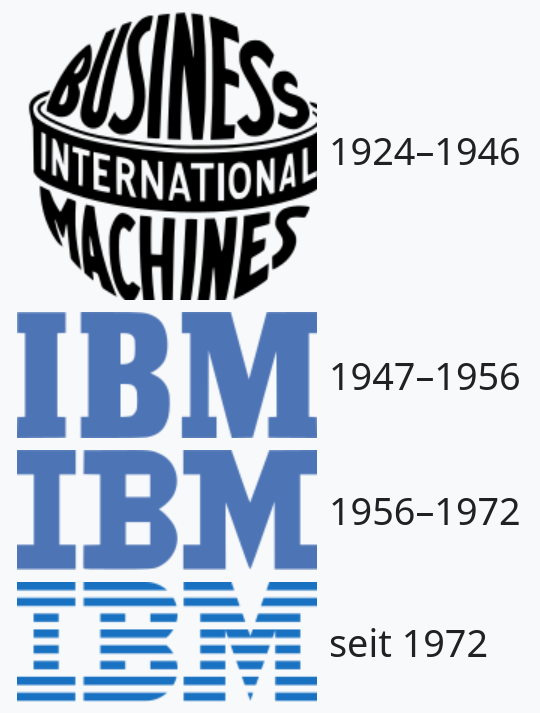

<!--
- Ballot counting stopped because manufacturers were held liable for votes not counted
-->

---

<!-- _header: Thomas J. Watson Sr. -->
<!-- footer: '[[2]](https://en.wikipedia.org/wiki/Thomas_J._Watson)' -->

- headed CTR and IBM between 1914 and 1955
- was often called *the world's best salesman*
- spoke of "*systematically eliminating the competition*"

- shaped the IBM **culture**
  - Strong focus on sales and **loyalty**
  - Rewards for sales and ideas for improvement
  - Dress code, strict ban on alcohol (*also in private*)
  - **Company anthem** and songbook

<!--

- I wonder if there were already fruit baskets in the offices back then?

-->

---

<!-- _header: Trivia: THINK -->
<!-- footer: '[[3]](https://en.wikipedia.org/wiki/File:The_%22Think%22_sign_from_Spaceship_Earth_at_EPCOT_Center.jpg), [[4]](https://upload.wikimedia.org/wikipedia/commons/8/8a/Original_IBM_ThinkPad.jpg)' -->

- In 1911, Watson used the slogan for the first time

> The trouble with every one of us is that we don't think enough. We don't get paid for working with our feet - we get paid for working with our heads.

- Meaning deliberately kept vague, wanted to motivate **proactive action**
- Internal magazine was renamed **THINK**, employees receive **notebook** on joining the company
- later adorned offices and mainframes
- Became a **brand**: *ThinkPad*, *ThinkCentre*, *ThinkVision*,...
- IBM's business conference](https://www.ibm.com/events/think) is also called Think

---

<!-- _header: IBM - a brief profile -->
<!-- footer: '[[5]](https://en.wikipedia.org/wiki/IBM_Portable_Personal_Computer)' -->

Original model of the IBM PC
(1981, Model 5150)

First portable computer
(1984, Model 5155)

<!--

- Model 5150
  - Intel 8088 with 4.77 MHz
  - up to 256 kB RAM
  - 2x floppy
- Model 5155
  - Intel 8088 with 4.77 MHz
  - 256 - 640 KB RAM
  - 2x floppy, optional hard disk later
  - CGA graphics, monochrome

-->

---

<!-- _header: IBM - a brief profile -->
<!-- footer: '[[6]](https://en.wikipedia.org/wiki/IBM_PS/2_Model_L40_SX), [[7]](https://richardsapperdesign.com/products/thinkpad-700c/)' -->

First notebook
(1991, PS/2 Model L40 SX)

First ThinkPad
(1992, ThinkPad 700)

<!--

- Model 5150
  - Intel 8088 with 4.77 MHz
  - up to 256 kB RAM
  - 2x floppy
- Model 5155
  - Intel 8088 with 4.77 MHz
  - 256 - 640 KB RAM
  - 2x floppy, optional hard disk later
  - CGA graphics, monochrome

-->

---

<!-- _header: Important people in the ThinkPad cosmos -->
<!-- footer: '' -->

- Arimasa Naitoh
  - Father of ThinkPad
  - Japanese Engineer
- **Richard Sapper**
  - since 1979 senior design consultant at IBM
- David Hill
  - ThinkPad-Designchef
- **Dr. Ted Selker**
  - **TrackPoins** inventor

- Tom Hardy
  - IBM industrial designer
- George Karidis
  - **TrackWrite Keyboard** designer
  - also known as **Butterfly Keyboard**
- **Mark Pearson**
  - maintaines Linux support

---

<!-- _header: Trivia: Different TrackPoint types -->
<!-- footer: '[[8]](https://www.reddit.com/r/thinkpad/comments/h16v1f/tizio_and_thinkpad_the_perfect_classical)' -->

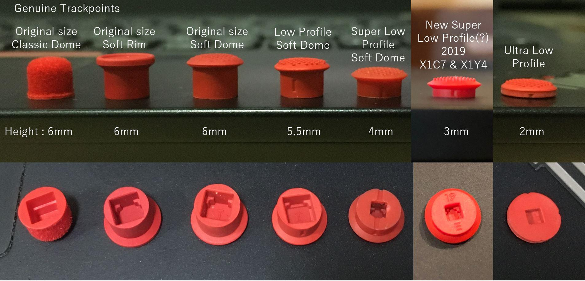

<!--

- have been optimized over the years
- have become smaller, as the devices also become smaller
- Cheaper replicas can be recognized by the fact that they quickly become **spotty**.

-->

---

<!-- _header: Richard Sapper -->
<!-- footer: '[[9]](https://en.wikipedia.org/wiki/Richard_Sapper)' -->

- German industrial designer (1932 - 2015†)
- grew up in Guatemala and Germany, emigrated to **Milan**
- one of the most important product designers of the second half of the 20th century
- known for numerous innovative designs, including
  - Artemide Tizio table lamp
  - Lorenz Static table clock
  - Alessi kitchen appliances
  - ...

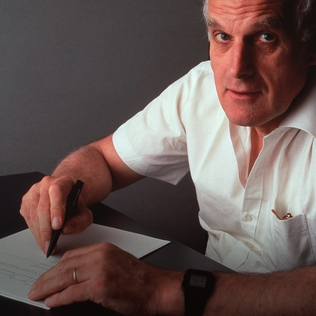

---

<!-- _header: Richard Sapper -->
<!-- footer: '[[10]](https://commons.wikimedia.org/wiki/File:Lampe_Tizio_von_Richard_Sapper.jpg), [[11]](https://richardsapperdesign.com/products/static/)' -->

Artemide Tizio and Lorenz Static

<!--

- Lorenz Static (1960)
- Artemide Tizio (1972)

-->

---

<!--
footer: '[[12]](https://www.reddit.com/r/thinkpad/comments/h16v1f/tizio_and_thinkpad_the_perfect_classical)'
-->

<!--

- Artemide Tizio 50 + ThinkPad T430

-->

---

<!--
_header: Richard Sapper
footer: '[[9]](https://en.wikipedia.org/wiki/Richard_Sapper)'
-->

- from 1979 **leading design consultant** at IBM
- shaped and standardized IBM designs:
    - **Personality Study** defined empty cases into which computers could be built, among other things
    - **black** color for ThinkPads
    - **red** TrackPoint

---

<!-- _header: IBM PC Convertible Model 5140 (1986) -->
<!-- footer: '[[13]](https://richardsapperdesign.com/products/mod-5140/)' -->

- produced in Boca Raton (Florida)
- there is an alligator plague there
- Design picks up on this
  - Keyboard = teeth
  - opening button = eye
  - printer = tail
- requires lateral viewing...

---

<!-- _header: IBM PC Convertible Model 5140 (1986) -->

---

<!-- _header: 'Trivia: Beige and black ThinkPads' -->
<!-- footer: '' -->

- earlier IBM devices had a **beige** color
  - e.g. IBM PC, Convertible, PS/2 Model L40 SX,...
  - easy and inexpensive to produce
- Sapper hated design and color
  - *"ugly, stupid, boring box "*
- some early devices were available in both beige and **black**
  - beige for *retail*, black for *business customers*

- Rumors about a German **workplace standard** in the 70s
  - prescribed contrast and **lighting values** for office computers
  - was adopted by other EU countries

<!--
- black + beige: 700, 720, 750

-->

---

<!-- _header: 'Trivia: Beige and black ThinkPads' -->

- IBM Germany therefore spoke out against black
- They thought about **pebble gray** devices, but rejected the idea
- The regulation was later relaxed, as long as there was a note in the manual
  - *"This product is not intended for office use "*

- Sapper wanted black housings
  - Difference to the competition, **mystical** appearance
  - better **contrast** of the early color displays
- skillfully ended debate
  - made IBM Chairman **John Akers** choose between two designs
  - he chose black, Sapper made himself unpopular in Boca Raton

<!--

- Survey revealed
  - One third of customers bought ThinkPads because of the design

-->

---

<!-- _header: 'Trivia: Red contrast color' -->

- Sapper likes to use red as a contrasting color
  - **Interaction areas** can be recognized more easily
  - emotional connotation
- argued with IBM's corporate identity department for a long time
  - stated that red was reserved for the **emergency shutdown** of the mainframes
  - did not want any other use

- Sappers then designed a **magenta-colored** TrackPoint
  - iteratively adjusted the color without changing the color code (**TP333**)
  - IBM did not notice the changes before production
  - Color was well received, was compared to luxury sports cars

---

<!-- _header: Ready for the next layer? -->

---

<!-- _header: Model series from 1991 to 1999 -->

| Series | Description |
| ------ | ----------- |
| 200 | Particularly compact subnotebooks, up to 10.4" |
| 300 | Entry-level models, exactly **DIN A4** size |
| 500 | Ultraportable devices without floppy/CD |
| 600 / 700 | Upper class, high quality and stable |
| 800 | Models with IBM PowerPC CPU |
| 1000 | **i Series**, prosumer devices produced by **Acer** |

- three-digit number, based on BMW models
- Production sequence is **not** apparent from the numbering
  - e.g. 345 appeared after 350

---

<!-- _header: Model series from 1991 to 1999 -->
<!-- footer: '[[14]](https://thinkwiki.de/Datei:550BJ.jpg)' -->

ThinkPad 240

ThinkPad 550BJ with integrated printer

<!--

- 550BJ
  - Intel 486
  - Monochrome STN display
  - Bubble Jet printer
  - Colabo between IBM Japan and Canon

-->

---

<!-- _header: 760EL details (1996) -->
<!-- footer: '' -->

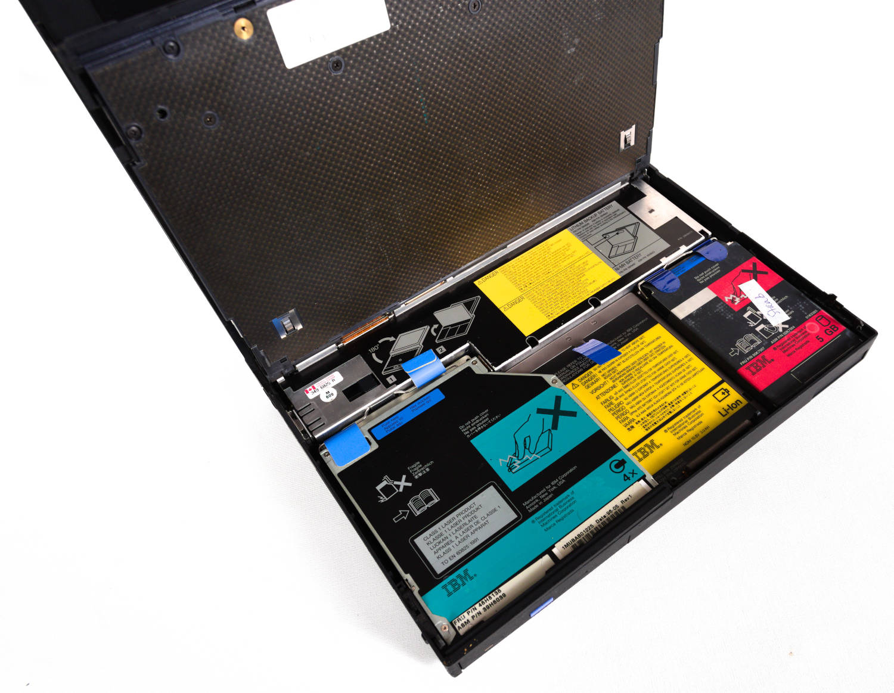

Modular design

Keyboard is lifted when opened

---

<!-- _header: Model series from 1991 to 1999 -->
<!-- footer: '[[15]](https://photos.google.com/share/AF1QipO52rP1VsA7X3W-jMP5pSI6szBKNUtcz8vKa7rpMi-lc8GhH_qakCFNGeEkBe6Ydw?key=M3RCcGM3X1JBN3o3cDNlLXNtcUJUaTF5SW9xbkZn)' -->

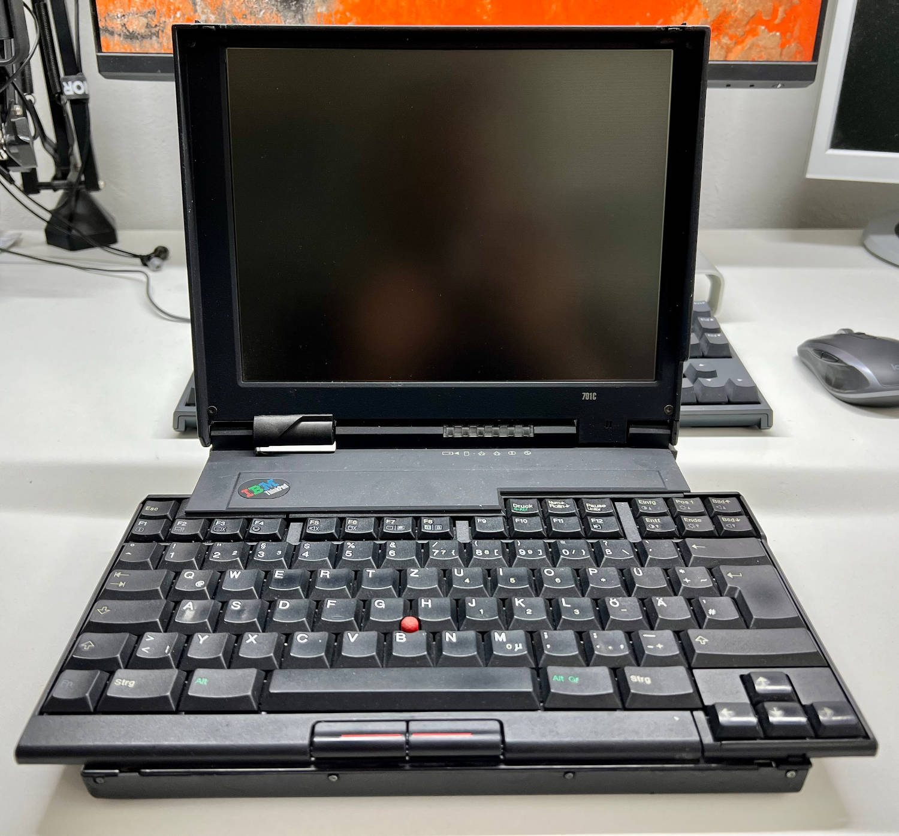

TrackWrite keyboard

ThinkPad 820 (1995)

<!--

- 701c
  - Keyboard folds out diagonally when opened
  - very sophisticated mechanism
  - Benchmark was: comfortable typing on the narrow table of an airplane
  - unfortunately appeared too late, was technically outdated by then
    - 486 instead of Pentium 1
  - coveted collector's item
- 800, 820, 850
  - one of the rarest ThinkPads ever
  - 3 PowerPC ThinkPads produced from 1995 to 1997
  - IBM's answer to the trend towards UNIX workstations?
    - SCSI drive
  - Support for IBM AIX and Windows NT
    - also runs with Linux and BSD

-->

---

<!-- _header: 'Trivia: ThinkPad as Mainframe console' -->
<!-- footer: '[[16]](https://commons.wikimedia.org/wiki/File:IBM_S-390_Parallel_Enterprise_Server-12-1998-gje.jpg), HMC = **H**ardware **M**anagement **C**onsole' -->

- Mainframes have several **HMCs**
  - are used for starting and controlling
- are generally rarely used
  - debugging, troubleshooting

- For a long time, **ThinkPads** served as HMC
- popular collector's items
  - Optical top condition
  - usually missing WLAN and modem

---

<!-- _header: 'Trivia: ThinkPad as Mainframe console' -->
<!--
footer: '[[17]](https://www.reddit.com/r/thinkpad/comments/19d7nhd/classic_thinkpads_were_installed_in_ibm_mainframes/)'
-->

ThinkPad 380E (1998)

IBM OS/2 with management application

---

<!-- _header: Model series from 1999 to 2008 -->
<!-- footer: '' -->

| Series | Description |
| ------ | ----------- |
| T | Best known series, emerged from 600/700 |
| A | Heavy desktop replacements, evolved from 300 |
| R | Cheaper than T series, plastic instead of rubber coating |
| G | Inexpensive desktop replacements, manufactured by **Acer** |
| Z | Short-produced multimedia series, widescreen tests |
| X | ultraportables and convertibles, emerged from 200/500 |
| S | particularly small ultraportables with 10.4", **Asia-only** |

<!--

- Restricted to series letters and two-digit number starting with **20**
  - this also does not provide any information about the production period
  - X32, for example, appeared after the X40

-->

---

<!-- _header: Model series from 1999 to 2008 -->

X40 in UltraBay (2004)

Z61m with Titanium cover (2006)

<!--

- Z61m
  - Titanium cover weighs an additional **400g**!

-->

---

<!-- _header: Model series from 1999 to 2008 -->

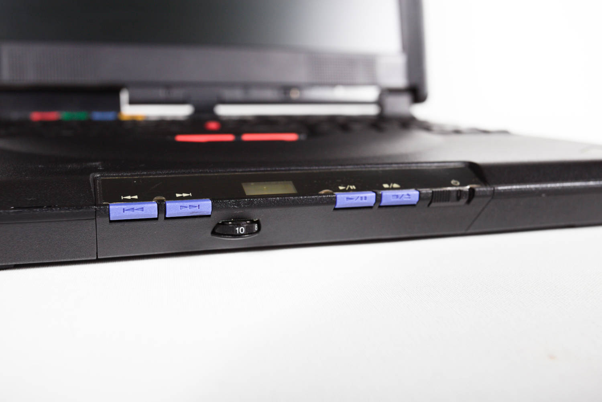

CD-Player in i-Series 1500

Japanese keyboard of a S30

---

<!-- _header: Model series from 1999 to 2008 -->

Angled housing shape of the G40

<!--

- there were only three G-ThinkPads (G40, G41 and G50)
  - G40 has a **desktop** (!!!) Pentium 4
- co-produced with Acer
- designed as an inexpensive office machine
- discontinued because there were too few differences to other series

-->

---

<!-- _header: UltraBay -->
<!-- footer: '[[18]](https://thinkwiki.de/UltraBay)' -->

- Interchangeable drive bay
  - 1993 - 2014
- can usually be changed during operation
- for a variety of **modules**
  - floppy disks and LS/ZIP drives
  - optical drives
  - additional **accumulator**
  - additional hard disk
  - RS232/LPT adapter

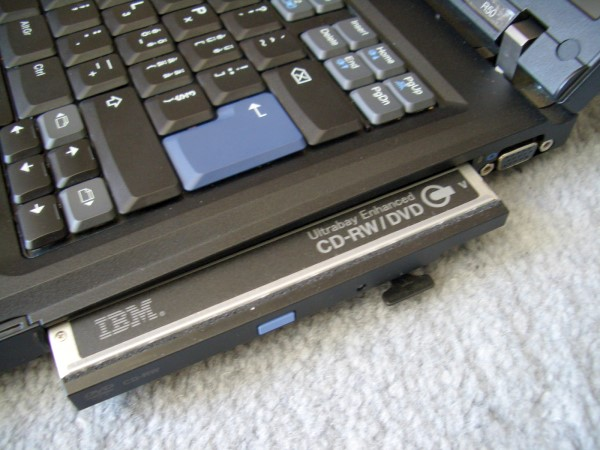

R50 with UltraBay drive

<!--

- spotted in vocational school: **T61p** with three batteries
  - attached to the rear side
  - UltraBay
  - Under-buckle battery

-->

---

<!-- _header: UltraBay -->
<!-- footer: '[[18]](https://thinkwiki.de/UltraBay), [[19]](http://www.ymmfa.com/read-gktid-27003.html)' -->

Numpad (22P7330)

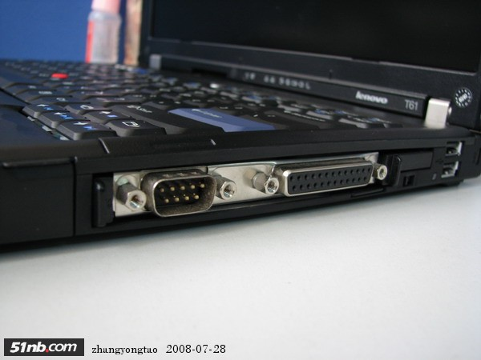

Serial and Parallel Port Adapter (40Y8121)

--- 

<!-- _header: Trivia: UltraPort -->
<!-- footer: '[[20]](https://www.lenovoblog.cz/2019/02/ibm-thinkpad-ultraport-milenialni-konektor-pro-pripojeni-ruznorodeho-prislusenstvi.html)' -->

- Proprietary USB 1.1 port on the top of the screen
- upgraded optional **modules**
  - Bluetooth and infrared adapter
  - Webcam, microphone
  - CompactFlash card reader
- briefly installed between **2000** and **2003**
  - A2x and A3x
  - T2x
  - X2x

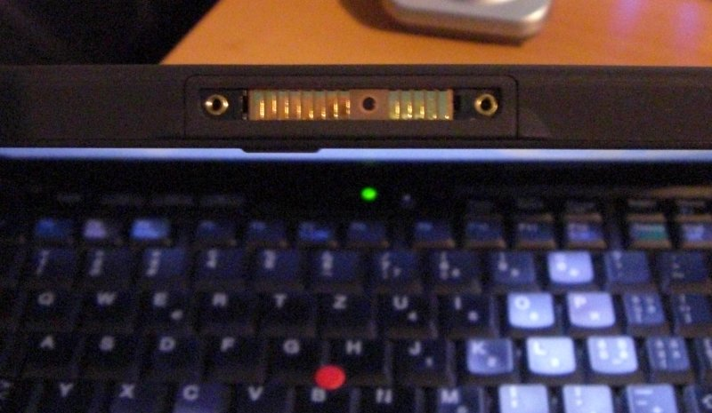

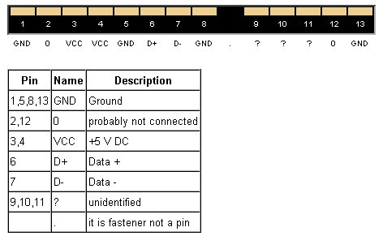

UltraPort on a X21

---

<!-- _header: Trivia: UltraPort -->

T23 with Webcam

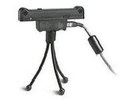

Microphone on a tripod

CF card reader

<!--

- I wonder what the CF reader looks like mounted on the screen?
- maybe that inspired Apple to create the "Dynamic Island"... 🤡

-->

---

<!-- _header: 'Far away from notebooks: IBM WorkPad' -->
<!-- footer: '' -->

- offered between **1997** and **2001
- 9 re-labeled **Palm** PDAs
- technically unchanged, only different housing color and logo
- **UltraBay** docking station
- discontinued due to lack of interest
- Shout-Out: [In ❤️ with PDA](https://inlovewithpda.de/)

IBM WorkPad (1997)

---

<!-- _header: 'Far away from notebooks: IBM WorkPad' -->
<!-- footer: '[[21]](https://www.thinkwiki.org/wiki/Ultrabay_Plus_WorkPad_c500_Cradle)' -->

IBM WorkPad and WorkPad 20X

Ultrabay Plus WorkPad c500 Cradle (27P5738)

---

<!-- _header: Model series from 2008 to 2016 -->
<!-- footer: '' -->

- Model name after the letter now three digits
- now also includes the **screen size** (*first digit after the letter*):
  - T400 = 14.1" inch
  - T500 = 15.4" inch
- the next two digits now stand for the **generation**:
  - T400, T410, T420,...
- first generation completely designed by Lenovo
- **Display hooks** are rationalized
- new **Precision Keyboard**

<!--

- in the previous generation, some devices were still made by IBM (*e.g. X41*) or were produced by Lenovo and IBM (*e.g. T60*)

-->

---

<!-- _header: Classic 7-Row (T400) and Precision Keyboard (T470p) -->

<!--

- larger keys
- more space between the keys
- 6 instead of 7 rows
- no more blue contrasts
- special keys are replaced by **key combinations**

-->

---

<!-- _header: Model series from 2008 to 2016 -->

Changes compared to previous series:

| Series | Description |
| ------ | ----------- |
| L | Replaces the R series, consumer BIOS |
| E | New cheapest series, quality below L-series |
| X | 12.1", 12.5" and 13.3", also convertible tablets |
| X1 | 14" UltraBooks and Convertible Tablets (**Yoga**) |
| W | Certified workstations, replaces Axxp and Txxp models |

---

<!-- _header: Model series from 2008 to 2016 -->
<!-- footer: '[[22]](https://youtube.com/watch?v=_hnOCUkbix0), [[23]](https://thinkwiki.de/W701)' -->

X300 as "MacBook Air" killer

W701ds with 2 screens

---

<!-- _header: Model series since 2016 -->
<!-- footer: '' -->

| Series | Description |
| ------ | ----------- |
| T | 14-16", optionally now also **AMD** and **ARM** (T14s G6) |
| X | Discontinued in favor of the X1 series |
| X1 | UltraBooks and a test ultraportable (X1 Nano) |
| X13 | 13" devices - **X13s** is the first ARM device |
| P | Workstations with new housings, replaces W series |
| Z | modern design, thin display bezels, **AMD-only** |

- simpler scheme from 2020
  - Digits stand for display size (*e.g. T14 -> 14"*)
  - followed by the generation as a separate word (*e.g. Gen 2*)

<!--

- P matches the **ThinkStation P Series** devices

-->

---

<!-- _header: Model series since 2016 -->
<!-- footer: '[[24]](https://www.notebookcheck.com/ThinkPad-Z13-Gen-2-Laptop-im-Test-Lenovos-Antwort-auf-das-Dell-XPS-13.795442.0.html), [[25]](https://www.notebookcheck.com/Lenovo-ThinkPad-X1-Nano-Laptop-im-Test-Business-Subnotebook-mit-LTE-wiegt-noch-nicht-einmal-1-kg.517236.0.html)' -->

Z13 G2 (2024)

X1 Nano (2021)

<!--

- Z13
  - dispenses with additional buttons in the TouchPad
  - Very thin display edges
  - Camera protrudes and also serves as an opening
- X1 Nano
  - weighs less than 1 kg
  - Magnesium + carbon fiber
  - very compact robust

-->

---

<!-- _header: 'Trivia: Anniversary models' -->
<!-- footer: '' -->

Special models have been released for some of the anniversaries:

- [ThinkPad Reserve Edition](https://thinkwiki.de/X61#ThinkPad_Reserve_Edition)
  - for the 15th anniversary
  - X61s in leather case with exclusive service
  - Cost: **5,000 USD**
* [ThinkPad X1 Carbon G10 30th Anniversary](https://www.notebookcheck.com/Test-Lenovo-ThinkPad-X1-Carbon-G10-30th-Anniversary-Laptop-OLED-Edition-mit-Ausdauer-Problem.673951.0.html)
  - special X1C G10 with OLED display
  - special logo with classic IBM colors
  - limited to 5,000
  - Cost: **2,500 EUR**

---

<!-- _header: 'Trivia: Anniversary models' -->
<!-- footer: '[[26]](https://thinkwiki.de/X61), [[27]](https://www.notebookcheck.com/Test-Lenovo-ThinkPad-X1-Carbon-G10-30th-Anniversary-Laptop-OLED-Edition-mit-Ausdauer-Problem.673951.0.html)' -->

Reserve Edition (2007)

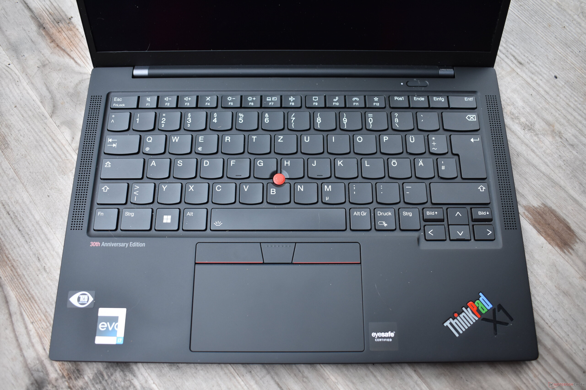

X1C G10 30th (2022)

---

<!-- _header: ThinkPad T25 Anniversary Edition -->
<!-- footer: '' -->

- Released in 2017 for the 25th anniversary
- based on the **T470**
- classic **7-row keyboard**
- glass touchpad
- Logo in classic IBM colors
- limited to approx. 1,000, 300 for Germany

---

<!-- _header: ThinkPad T25 Anniversary Edition -->

---

<!-- _header: Pop and nerd culture -->
<!-- footer: 'CRU = **C**ustomer **R**eplaceable **U**nit; HMM = **H**ardware **M**aintenance **M**anual' -->

- Popular in the business environment due to **quality**
  - Repairability has decreased somewhat due to thinner devices
  - many components can be maintained by the user (**CRU**)
    - Keyboard, SSD, RAM,...
    - new **LPCAMM2** RAM enables thin modules and high speed
  - maintenance manuals freely available (**HMM**)

- Popular with hackers mainly because of good **Linux support**
  - IBM saw the added value early on
  - applies above all to T, P and X devices
  - [Presentation by **Mark Pearson** on Linux support (DebConf 22)](https://debconf22.debconf.org/talks/10-lenovo-linux-2022/)

<!--

- Lenovo setzt sich zusammen mit Dell und anderen Herstellern gegen verlöteten RAM ein

-->

---

<!-- _header: Pop and nerd culture -->
<!-- footer: '' -->

- **Framework** notebooks are now also widespread
  - Criticism of soldered RAM in the meantime
  - Locks for some components (*e.g. WLAN*)
  - Keyboards unfortunately no longer a unique selling point as they used to be

- Sticker trend for notebook covers
  - see also [DevLids](https://www.devlids.com/)
- **Memetic relevance**

<!--

- WLAN Kartensperre aufgrund von Export- und Frequenzbeschränkungen

-->

---

<!-- _header: Memetic relevance -->

---

<!-- _header: Memetic relevance -->
<!-- footer: '[[28]](https://www.reddit.com/r/thinkpad/comments/112wxih/custom_boot_screen_on_my_p1_gen4/)' -->

---

<!-- _header: ThinkPad mods from the maker scene -->
<!-- footer: '' -->

There are numerous community mods that extend the devices:

- USB-C PD mods, e.g. [for T41/T43](https://kittenlabs.de/projects/usb-c-mods/t41-usb-c/)
- [BIOS mods](https://www.thinkwiki.org/wiki/Custom_BIOS)
  - e.g. to remove limitations
  - [Libreboot](https://libreboot.org) and [Coreboot](https://www.coreboot.org/)
- [NVMe BIOS Boot Option](https://kittenlabs.de/nvmeboot/)

- Frankenpads](https://thinkwiki.de/Frankenpad)
  - heavily customized ThinkPads, with newer components, etc.
- 51nb mods with completely revised mainboards
  - [X62 (X61)](https://www.notebookcheck.com/Test-Lenovo-IBM-Thinkpad-51nb-X62-Custom-Laptop.212686.0.html), [X210 (X200/201)](http://www.cnmod.cn/x210/), [X330 (X230)](https://www.xyte.ch/mods/x230/), [T700 (T60/61)](https://www.xyte.ch/t700-crowdfunding/)

<!--

- 51nb mods are super interesting, but quite expensive (due to the small print run)

-->

---

<!-- _header: ThinkPads in movies and series -->

Eine Auswahl:

  - [The Matrix (1999)](https://www.reddit.com/r/thinkpad/comments/c0vvs5/thinkpad_760_series_spotted_in_the_matrix_1999/)
- [The Gentleman (2019)](https://www.reddit.com/r/thinkpad/comments/kyfd2g/thinkpads_in_movies_the_gentlemen_2019/)
- [Knives Out (2019)](https://productplacementblog.com/movies/lenovo-thinkpad-t61-laptop-used-by-christopher-plummer-as-harlan-thrombey-in-knives-out-2019/)
- [Black Widow (2021)](https://www.reddit.com/r/thinkpad/comments/omljet/thinkpads_in_movies_black_widow_2021/)
- Homeland (Staffel 1 und 5)
- Law and Order: Special Victims Unit
- Law and Order: Criminal Intent

Quellen: Reddit und [Product Placement Blog](https://productplacementblog.com/tag/thinkpad/)

<!--

- Homeland T430, T530/W530 mit Windows Vista-Stickern auf dem Deckel

-->

---

<!-- _header: ThinkPad T61 in Knives Out (2019) -->
<!-- footer: '[[29]](https://productplacementblog.com/movies/lenovo-thinkpad-t61-laptop-used-by-christopher-plummer-as-harlan-thrombey-in-knives-out-2019/)' -->

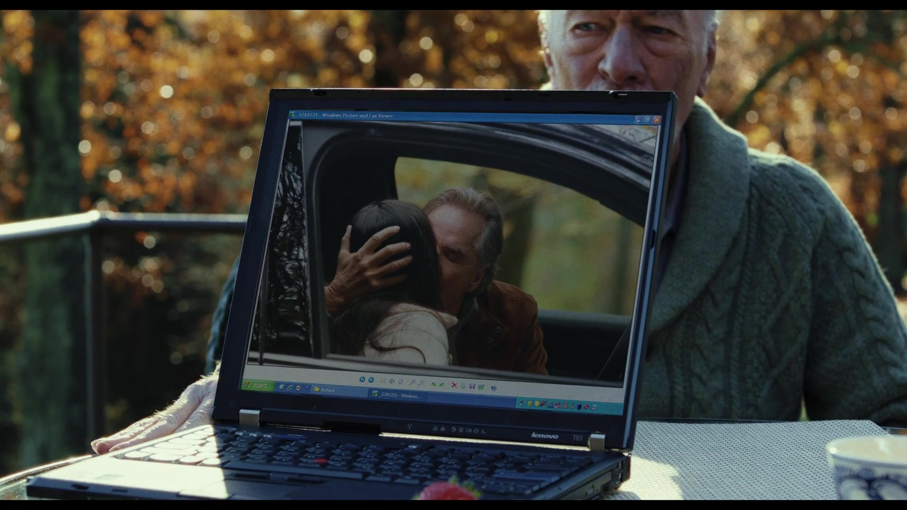

---

<!-- _header: ThinkPad 750 (1993) or 360 (1994) in Black Widow (2021) -->
<!-- footer: '[[30]](https://www.reddit.com/r/thinkpad/comments/omljet/thinkpads_in_movies_black_widow_2021)' -->

---

<!-- _header: `raise BufferOverflowException('Stahp')` -->
<!-- footer: '' -->

---

<!-- _header: Links -->

- [ThinkPad-Forum](https://thinkpad-forum.de) 🇩🇪
- [ThinkPad-Wiki](https://thinkwiki.de) 🇩🇪
- [International ThinkWiki](https://thinkwiki.org)
- [Notebookcheck posts about ThinkPads](https://www.notebookcheck.com/News.37.0.html?ns_layout=3&hide_youtube=1&ns_show_num_normal=50&hide_external_reviews=1&tagArray%5B%5D=153&typeArray%5B%5D=4&typeArray%5B%5D=6&id=37) 🇩🇪
- [Laptop Retrospective](https://laptopretrospective.com) 🎥📖
- [HK003 - ThinkPads](https://hacker-kultur.de/episodes/003.html) 🎙️🇩🇪
- [BW099 - Ein denkwürdiges Notebook](https://besserwissen.podigee.io/99-thinkpad) 🎙️🇩🇪
- [ThinkPad-Museum](https://thinkpad-museum.com)
- [ThinkPad-Museum Datenbank](https://db.thinkpad-museum.com)

---

<!-- _header: Books -->

There are suitable **books** on these topics:

- How the ThinkPad Changed the World - and Is Shaping the Future
  - Arimasa Naitoh, William J. Holstein
- The Race for Perfect
  - Steve Hamm, Story über das X300
- ThinkPad: A Different Shade of Blue
  - Deborah A. Dell, J. Gerry Purdy
- **Richard Sapper, Edited by Jonathan Olivares**
  - Hardcover book with a lot of photos

---

<!-- _header: ThinkPad museum podcast (🇩🇪) -->

- published every **~4 weeks**
- deals with the past and present
- News, models, techniques and personalities
- **interactive** format, guests welcome!
- available wherever you get your podcasts™
  - [Feed](https://podcasts.darmstadt.social/@thinkpadmuseum/feed.xml), [fyyd](https://fyyd.de/podcast/thinkpad-museum-podcast), [Apple Podcasts](https://podcasts.apple.com/us/podcast/thinkpad-museum-podcast/id1722845536), [Spotify](https://open.spotify.com/show/1Tyf65RpY3bKZr0xYVFhjc)

---

<!-- _header: Image sources -->

- [IBM-Logos](https://de.wikipedia.org/wiki/IBM)
- [Thomas J. Watson Sr.](https://en.wikipedia.org/wiki/Thomas_J._Watson)
- [Think (Slogan)](https://en.wikipedia.org/wiki/File:The_%22Think%22_sign_from_Spaceship_Earth_at_EPCOT_Center.jpg)
- [Think (Notizbuch)](https://upload.wikimedia.org/wikipedia/commons/8/8a/Original_IBM_ThinkPad.jpg)
- [IBM PC und Portable](https://en.wikipedia.org/wiki/IBM_Portable_Personal_Computer)
- [IBM PS/2 Model L40 SX](https://en.wikipedia.org/wiki/IBM_PS/2_Model_L40_SX)
- [ThinkPad 700](https://richardsapperdesign.com/products/thinkpad-700c/)
- [Richard Sapper](https://en.wikipedia.org/wiki/Richard_Sapper)
- [Artemide Tizio](https://commons.wikimedia.org/wiki/File:Lampe_Tizio_von_Richard_Sapper.jpg)
- [Lorenz Static](https://richardsapperdesign.com/products/static/)
- [Tizio und T430](https://www.reddit.com/r/thinkpad/comments/h16v1f/tizio_and_thinkpad_the_perfect_classical)
- [IBM Model 5140](https://richardsapperdesign.com/products/mod-5140/)
- [ThinkPad 550BJ](https://thinkwiki.de/550)
- [ThinkPad 820 (Sarah Mädel / manawyrm)](https://photos.google.com/share/AF1QipO52rP1VsA7X3W-jMP5pSI6szBKNUtcz8vKa7rpMi-lc8GhH_qakCFNGeEkBe6Ydw?key=M3RCcGM3X1JBN3o3cDNlLXNtcUJUaTF5SW9xbkZn)

- [ThinkPad HMC](https://www.reddit.com/r/thinkpad/comments/19d7nhd/classic_thinkpads_were_installed_in_ibm_mainframes/)
- [UltraBay](https://thinkwiki.de/UltraBay)
- [UltraBay Serial/Parallel](http://www.ymmfa.com/read-gktid-27003.html)
- [UltraPort](https://www.lenovoblog.cz/2019/02/ibm-thinkpad-ultraport-milenialni-konektor-pro-pripojeni-ruznorodeho-prislusenstvi.html)
- [UltraBay WorkPad Cradle](https://www.thinkwiki.org/wiki/Ultrabay_Plus_WorkPad_c500_Cradle)
- [X300](https://youtube.com/watch?v=_hnOCUkbix0)
- [W701ds](https://thinkwiki.de/W701)
- [Z13 G2](https://www.notebookcheck.com/ThinkPad-Z13-Gen-2-Laptop-im-Test-Lenovos-Antwort-auf-das-Dell-XPS-13.795442.0.html)
- [X1 Nano](https://www.notebookcheck.com/Lenovo-ThinkPad-X1-Nano-Laptop-im-Test-Business-Subnotebook-mit-LTE-wiegt-noch-nicht-einmal-1-kg.517236.0.html)
- [Reserve Edition](https://thinkwiki.de/X61)
- [X1 Carbon G10 30th](https://www.notebookcheck.com/Test-Lenovo-ThinkPad-X1-Carbon-G10-30th-Anniversary-Laptop-OLED-Edition-mit-Ausdauer-Problem.673951.0.html)
- [Lenowo BIOS logo](https://www.reddit.com/r/thinkpad/comments/112wxih/custom_boot_screen_on_my_p1_gen4/)
- [Knives Out](https://productplacementblog.com/movies/lenovo-thinkpad-t61-laptop-used-by-christopher-plummer-as-harlan-thrombey-in-knives-out-2019/)
- [Black Widow](https://www.reddit.com/r/thinkpad/comments/omljet/thinkpads_in_movies_black_widow_2021)

---

<!-- _class: lead -->

# 🔴 Thank you for your attention
