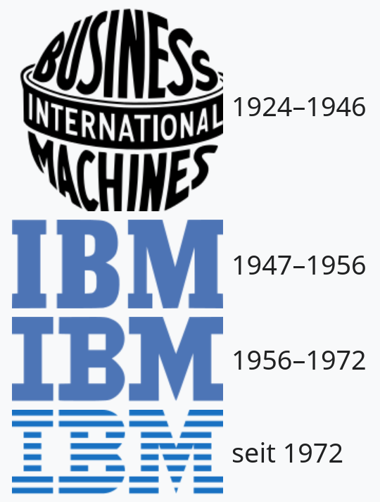
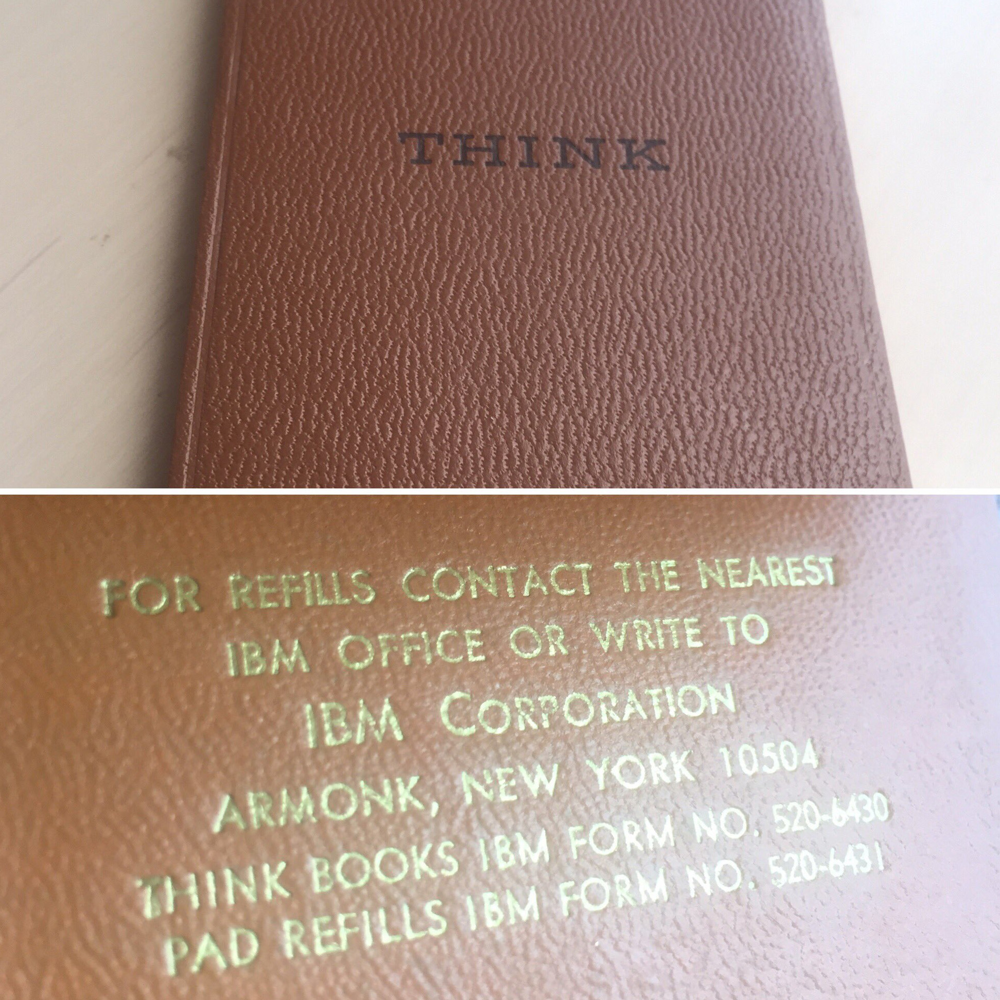
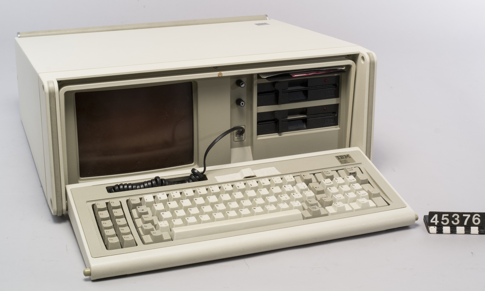
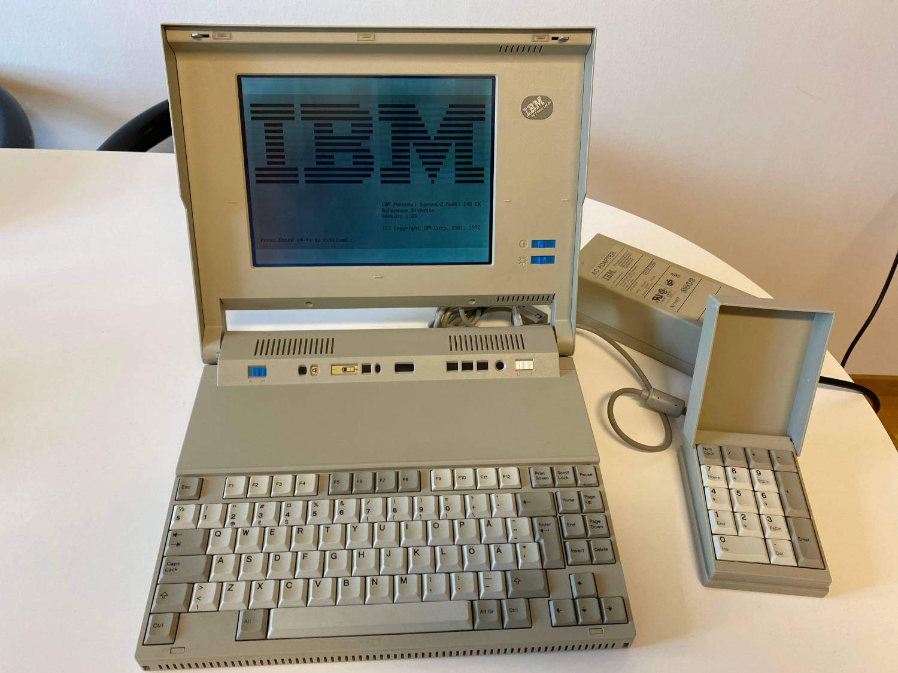
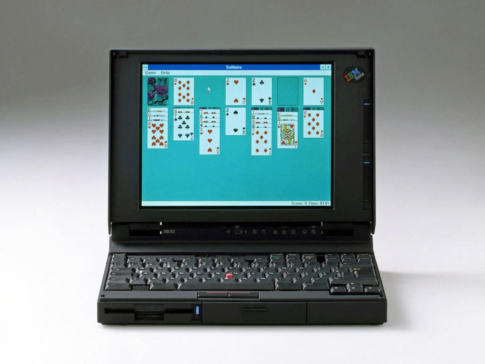
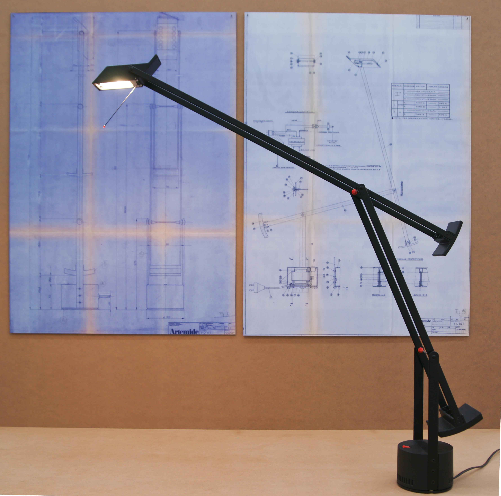
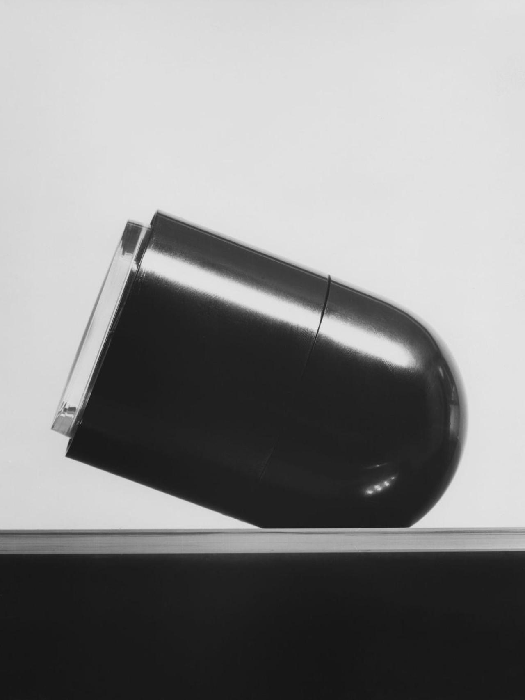
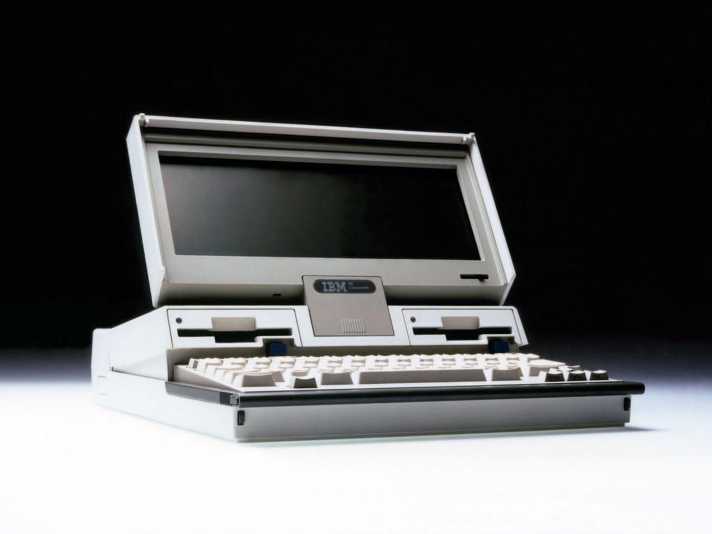
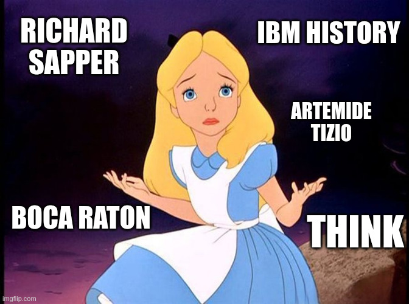
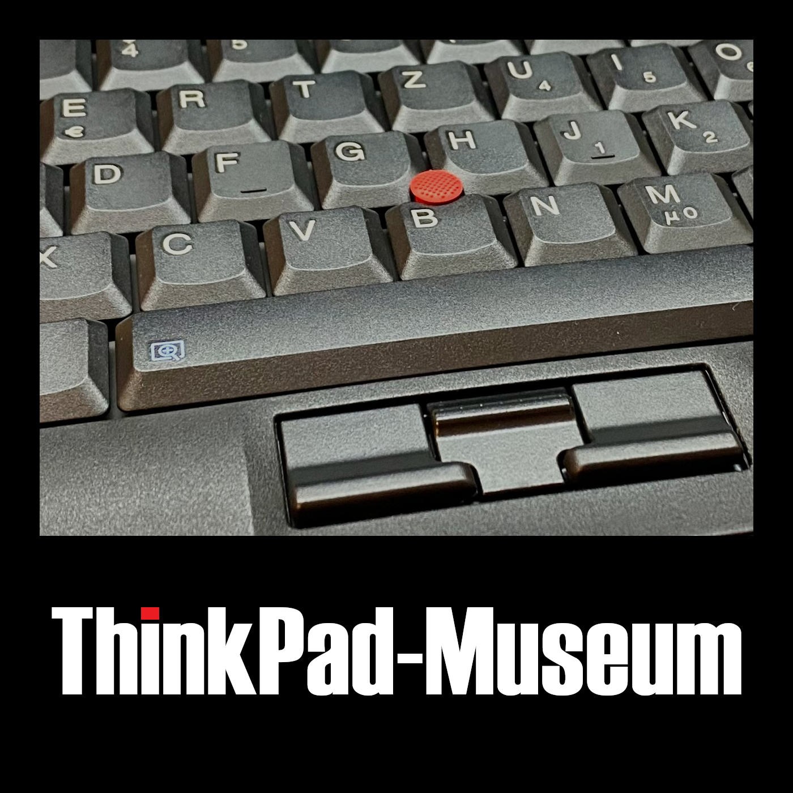

<!-- _class: lead -->

# 🔴 ThinkPads

#### Geschichte und Nerdkultur

 

Christian Stankowic
FrOSCon 2024
18.08.2024

---

<!-- _header: `whoami` -->

- Christian Stankowic
- [@stdevel@chaos.social](https://chaos.social/@stdevel) 🐘
- IT-Berater und -Trainer 👨🏻‍🏫
- sammelt obsolete Hardware
- Blogger ([cstan.io](https://cstan.io) 📖)
- Podcaster 🎙️
  - [FOCUS ON: Linux](https://focusonlinux.podigee.io) 🐧
  - [Faxinformatiker](https://faxinformatiker.de) 📠
  - [ThinkPad-Museum](https://thinkpad-museum.de/episode) 💻

---

<!-- _header: Agenda -->

1. Motivation
1. Geschichte
1. Wichtige Serien, Modelle und Kuriositäten
1. Pop- und Nerdkultur

---

<!-- _header: Motivation -->

- TODO
- Wieso ThinkPads?
- Beispielfoto
- Wie kam ich zu ThinkPads?

---

<!-- _header: Ready? -->

---

<!-- _header: IBM - ein Kurzprofil -->

- geht auf **Tabulating Machine Company** zurück
  - **1986** von **Herman Hollerith** gegründet
  - Erfinder des Hollerith-**Lochkartenverfahrens**
  - speziell für USA-Volkszählung 1890 entwickelt

- **1911** als **Computing-Tabulating-Recording Company (CTR**) gegründet
- kombinierte drei Unternehmen
    - **C**omputing Scale Corporation
    - **T**abulating Machine Company (Hollerith)
    - International Time **R**ecording

<!--
- Tabelliermaschinen können im Heinz Nixdorf Museum in Paderborn begutachtet werden
- 113 Jahre bewegte Firmengeschichte
  - von Lochkarten und Stechuhren über Röhrenrechner, Mainframes bishin zu Personal Computer und Quantencomputer
-->

---

<!-- _header: IBM - ein Kurzprofil -->

- CTR beschäftigte **1.300 Mitarbeitende** und spezialisierte sich auf Lochkarten, Waagen und Uhren
- **1924** wurde CTR in **International Business Machines** umbenannt
- Fokus auf Unternehmen
  - Lochkartensortierer/-locher und Tabelliermaschinen
  - Lochkarten-**Monopol**

<!--
- Stimmzettel-Zählungen eingestellt, weil die Hersteller für nicht gezählte Stimmen haftbar gemacht wurden
-->

---

<!-- _header: Thomas J. Watson Sr. -->

- leitete CTR und IBM zwischen 1914 und 1955
- wurde oft als *der weltbeste Verkäufer* bezeichnet
- sprach von "*systematischem Ausschalten der Konkurrenz*"

- prägte die IBM-**Kultur**
  - Starker Fokus auf Vertrieb und **Loyalität**
  - Prämien für Verkäufe und Verbesserungsideen
  - Dresscode, striktes Alkoholverbot (*auch privat*)
  - **Firmenhymne** und Liederbuch

<!--

- ob es damals schon Obstkörbe in den Büros gab?

-->

---

<!-- _header: Trivia: THINK -->

- 1911 benutzte Watson erstmalig den Slogan

> The trouble with every one of us is that we don't think enough. We don't get paid for working with our feet - we get paid for working with our heads.

- Bedeutung bewusst vage gehalten, wollte zu **proaktivem Handeln** motivieren
- Interne Zeitschrift wurde in **THINK** umbenannt, Mitarbeitende erhalten **Notizbuch** bei Einstieg
- zierte später Büros und Mainframes
- wurde zur **Marke**: *ThinkPad*, *ThinkCentre*, *ThinkVision*,...
- [IBMs Business-Konferenz](https://www.ibm.com/events/think) heißt ebenfalls Think

---

<!-- _header: IBM - ein Kurzprofil -->

- **195x/196x**: erste Computer mit Magnetplatten und Trommelspeicher
* **1962** - erste elektrische Schreibmaschine mit Kugelkopf
* **1965** / **1970** - neue Großrechner-Generationen S/360 und S/370
* **1981** - IBM Personal Computer
* **1984** - erster tragbarer Computer (*Portable PC 5155*) erscheint
  - im Zugzwang durch zuvor erschienenen Compaq Portable
* **1991** - erster Laptop (*PS/2 Model L40 SX*) erscheint
* **1992** bis **2004** - ThinkPads
* **2005** - Verkauf der PC-Sparte an Lenovo

---

<!-- _header: IBM - ein Kurzprofil -->

Urmodell des IBM PCs
(1981, Model 5150)

Erster tragbarer Computer
(1984, Model 5155)

<!--

- Model 5150
  - Intel 8088 mit 4,77 MHz
  - bis zu 256 kB RAM
  - 2x Floppy
- Model 5155
  - Intel 8088 mit 4,77 MHz
  - 256 - 640 KB RAM
  - 2x Floppy, optionale Festplatte später
  - CGA-Grafik, monochrom

-->

---

<!-- _header: IBM - ein Kurzprofil -->

Erster Laptop
(1991, PS/2 Model L40 SX)

Erstes ThinkPad
(1992, ThinkPad 700)

<!--

- Model 5150
  - Intel 8088 mit 4,77 MHz
  - bis zu 256 kB RAM
  - 2x Floppy
- Model 5155
  - Intel 8088 mit 4,77 MHz
  - 256 - 640 KB RAM
  - 2x Floppy, optionale Festplatte später
  - CGA-Grafik, monochrom

-->

---

<!-- _header: Wichtige Personen im ThinkPad-Kosmos -->

- **Arimasa Naitoh**
  - Father of ThinkPad
  - japanischer Ingenieur
- **Richard Sapper**
  - seit 1979 leitender Designberater bei IBM
- David Hill
  - ThinkPad-Designchef
- **Dr. Ted Selker**
  - Erfinder des TrackPoints

- Luis Hernandex
  - ThinkPad-Produktmanager
- Tom Hardy
  - IBM-Industriedesigner
- George Karidis
  - Designer des Butterfly Keyboards

---

<!-- _header: Richard Sapper -->

- deutscher Industriedesigner (1932 - 2015†)
- wuchs in Guatemala und Deutschland auf, wanderte nach **Mailand** aus
- einer der wichtigsten Produktdesigner der zweiten Hälfe des 20.Jahrhunderts
- bekannt für zahlreiche innovative Designs, u.a.
  - Artemide Tizio-Tischlampe
  - Lorenz Static-Tischuhr
  - Alessi-Küchgeräte
  - ...

---

<!-- _header: Richard Sapper -->

Artemide Tizio und Lorenz Static

<!--

- Lorenz Static (1960)
- Artemide Tizio (1972)

-->

---

<!--
footer: Quelle: [Reddit](https://www.reddit.com/r/thinkpad/comments/h16v1f/tizio_and_thinkpad_the_perfect_classical/#lightbox)
-->

<!--

- Artemide Tizio 50 + ThinkPad T430

-->

---

<!-- _header: Richard Sapper -->

<!--
footer: ''
-->

- ab 1979 **leitender Designberater** bei IBM
- prägte und vereinheitlichte IBM-Designs:
    - **Personality Study** definierte Leergehäuse, in die u.a. Computer gebaut werden konnten
    - **schwarze** Farbe bei ThinkPads
    - **roter** TrackPoint

---

<!-- _header: IBM PC Convertible Model 5140 (1986) -->

- in Boca Raton (Florida) produziert
- dort gibt es eine Alligator-Plage
- Design greift das auf
  - Tastatur = Zähne
  - Öffnungsknopf = Auge
  - Drucker = Schwanz
- erfordert seitliche Betrachtung...

---

<!-- _header: IBM PC Convertible Model 5140 (1986) -->

---

<!-- _header: Trivia: Beige und schwarze ThinkPads, TrackPoint -->

- TODO

---

<!-- _header: Ready for the next layer? -->

---

<!-- _header: Modellserien von 1991 bis 1999 -->

| Serie | Beschreibung |
| ----- | ------------ |
| 200 | Besonders kompakte Subnotebooks, 7.7" bis 10.4" |
| 300 | Einstiegsmodelle, exakt **DIN A4** groß |
| 500 | Ultraportable Geräte ohne Floppy/CD |
| 600 / 700 | Oberklasse, hochwertig und sehr stabil |
| 800 | Modelle mit IBM PowerPC-CPU |
| 1000 | **i Series**, von **Acer** produzierte Prosumer-Geräte |

- dreistellige Nummer, an BMW angelehnt
- Produktionsreihenfolge geht **nicht** aus Nummerierung heraus
  - 345 erschien z.B. nach 350

---

<!-- _header: Modellserien von 1991 bis 1999 -->

TODO - Fotos

ThinkPad 240
ThinkPad 550BJ
ThinkPad 570
ThinkPad 600
ThinkPad 701C
ThinkPad 800

---

<!-- _header: Modellserien von 1999 bis 2008 -->

- Beschränkung auf Serien-Buchstaben und zweistellige Nummer beginnend mit **20**
  - auch diese gibt keinen Rückschluss auf den Produktionszeitraum
  - X32 erschien z.B. nach dem X40

---

<!-- _header: Modellserien von 1999 bis 2008 -->

| Serie | Beschreibung |
| ----- | ------------ |
| T | Bekannteste Serie, ging aus 600/700 hervor |
| A | Schwere Desktop-Replacements, ging aus 300 hervor |
| R | günstiger als T-Serie, Kunststoff statt Gummierung |
| G | Günstige Desktop-Replacements, von **Acer** gefertigt |
| Z | kurz produzierte Multimedia-Serie, Widescreen-Tests, wurde 2022 neu aufgelegt |
| X | Hochwertige Ultraportables und Convertible Tablets, ging aus 200/500 hervor |
| S | besonders kleine Ultaportables mit 10.4", **Asia-only** |

---

<!-- _header: Modellserien von 1999 bis 2008 -->

TODO - Fotos

ThinkPad T23
ThinkPad A31p
ThinkPad G40
ThinkPad Z61p
ThinkPad X61s
ThinkPad S30
ThinkPad i-Series + CD

---

<!-- _header: UltraBay -->

- TODO

---

<!-- _header: Fernab von Notebooks: IBM WorkPad -->

- TODO
- umgelabelte Palm PDAs

---

<!-- _header: Modellserien von 2008 - 2016 -->

- Modellbezeichnung nach dem Buchstaben nun dreistellig
- beinhaltet nun auch die **Bildschirmgröße** (*erste Ziffer nach dem Buchstaben*):
  - T400 = 14.1"-Zoll
  - T500 = 15.4"-Zoll
- die nächsten beiden Ziffern stehen nun für die **Generation**:
  - T400, T410, T420,...
- erste Generation die komplett von Lenovo gestaltet wurde
- **Displayhaken** werden wegrationalisiert
- neues **Precision Keyboard**

<!--

- bei der vorherigen Generation stammten einige Geräte noch aus der Feder von IBM (*z.B. X41*) bzw. wurden von Lenovo und IBM produziert (*z.B. T60*)

-->

---

<!-- _header: Precision Keyboard -->

TODO Fotos Vergleich

---

<!-- _header: Modellserien von 2008 - 2016 -->

Änderungen gegenüber früheren Serien:

| Serie | Beschreibung |
| ----- | ------------ |
| L | Ersetzt die R-Serie, Consumer-BIOS |
| E | Neue günstigste Serie, qualitativ unterhalb L-Serie |
| X | 12.1", 12.5" und 13.3", auch Convertible Tablets |
| X1 | 14"-UltraBooks und Converible Tablets (**Yoga**) |
| W | Zertifizierte Workstations, ersetzt Axxp- und Txxp-Modelle |

---

<!-- _header: Modellserien von 2008 - 2016 -->

TODO - Fotos

ThinkPad L412
ThinkPad X301
ThinkPad W701
ThinkPad W701ds

---

<!-- _header: Modellserien seit 2016 -->

- Experiment mit zweistellige Bezeichnungen bei P-Serie
  - erste Ziffer steht für die **Displaygröße** (*z.B. P50 -> 15"*)
  - zweite Ziffer steht für die **Generation** (*z.B. P52 -> 3.Generation*)
- einfacheres Schema ab 2020
  - Ziffern stehen für Displaygröße (*z.B. T14 -> 14"*)
  - anschließend folgt die Generation als eigenes Wort (*z.B. Gen 2, Gen 3*)

---

<!-- _header: Modellserien seit 2016 -->

Änderungen gegenüber früheren Serien:

| Serie | Beschreibung |
| ----- | ------------ |
| T | 14-16", optional nun auch **AMD** sowie **ARM** (T14s G6) |
| X | Wird zugunsten der X1-Serie eingestellt |
| X1 | UltraBooks und testweise ein Ultraportable (X1 Nano) |
| X13 | 13"-Geräte - **X13s** ist das erste ARM-Gerät |
| P | Workstations mit neuen Gehäusen, ersetzt W-Serie |
| Z | Premium-Qualität mit modernem Design, dünne Displayränder, Aluminium und Kunstleder, **ausschließlich AMD** |

<!--

- P passt zu den **ThinkStation P Series**-Geräten

-->

---

<!-- _header: Modellserien seit 2016 -->

TODO - Fotos

ThinkPad Z13
ThinkPad T14 G6
ThinkPad X1 Nano
ThinkPad P16

---

<!-- _header: Jubiläumsmodelle -->

Für einige der Jubiläen wurden besondere Modelle veröffentlicht:

* [ThinkPad Reserve Edition](https://thinkwiki.de/X61#ThinkPad_Reserve_Edition)
  - zum 15. Jubiläum
  - in Lederhülle eingelassenes X61s mit Exklusiv-Service
  - Kosten: **5.000 USD**
* [ThinkPad X1 Carbon G10 30th Anniversary](https://www.notebookcheck.com/Test-Lenovo-ThinkPad-X1-Carbon-G10-30th-Anniversary-Laptop-OLED-Edition-mit-Ausdauer-Problem.673951.0.html)
  - spezielles X1C G10 mit OLED-Display
  - besonderes Logo mit klassischen IBM-Farben
  - auf 5.000 limitert
  - Kosten: **2.500 EUR**

---

<!-- _header: Jubiläumsmodelle -->

TODO - Fotos

Reserve Edition
X1C G10 30th

---

<!-- _header: ThinkPad T25 Anniversary Edition -->

- 2017 zum 25.Jubiläum veröffentlicht
- basiert auf dem **T470**
- klassische **7-Row Tastatur**
- Logo in klassischen IBM-Farben
- auf ca. 1.000 limitert, 300 für Deutschland

---

<!-- _header: Pop- und Nerdkultur -->

- TODO
- Beispiele aus Filmen und Serien
- Wieso so beliebt?
- Immer noch so? Wie sieht es mit dem Framework aus?
- verlöteter RAM, jetzt aber doch nicht mehr
- Reparierbarkeit wieder höher
- Tastaturen schlechter

---

<!-- _header: `raise BufferOverflowException('Stahp')` -->

---

<!-- _header: Links -->

- [ThinkPad-Wiki](https://thinkwiki.de)
- [Internationales ThinkWiki](https://thinkwiki.org)
- [Laptop Retrospective](https://laptopretrospective.com) (Content Creator)
- [Notebookcheck-Beiträge zu ThinkPads](https://www.notebookcheck.com/News.37.0.html?ns_layout=3&hide_youtube=1&ns_show_num_normal=50&hide_external_reviews=1&tagArray%5B%5D=153&typeArray%5B%5D=4&typeArray%5B%5D=6&id=37)
- [ThinkPad-Museum](https://thinkpad-museum.de)
- [ThinkPad-Museum Datenbank](https://db.thinkpad-museum.de)

---

<!-- _header: ThinkPad-Museum Podcast -->

- erscheint alle **~4 Wochen**
- beschäftigt sich mit der Geschichte und Gegenwart
- News, Modelle, Techniken und Persönlichkeiten
- **interaktives** Format, Gäst:innen willkommen!
- Überall, wo es Podcasts gibt™
  - [Feed](https://podcasts.darmstadt.social/@thinkpadmuseum/feed.xml), [fyyd](https://fyyd.de/podcast/thinkpad-museum-podcast), [Apple Podcasts](https://podcasts.apple.com/us/podcast/thinkpad-museum-podcast/id1722845536), [Spotify](https://open.spotify.com/show/1Tyf65RpY3bKZr0xYVFhjc)

---

<!-- _header: Bilderquellen -->

- [IBM-Logos](https://de.wikipedia.org/wiki/IBM)
- [Thomas J. Watson Sr.](https://en.wikipedia.org/wiki/Thomas_J._Watson)
- [Think (Slogan)](https://en.wikipedia.org/wiki/File:The_%22Think%22_sign_from_Spaceship_Earth_at_EPCOT_Center.jpg)
- [Think (Notizbuch)](https://upload.wikimedia.org/wikipedia/commons/8/8a/Original_IBM_ThinkPad.jpg)
- [IBM PC und Portable](https://en.wikipedia.org/wiki/IBM_Portable_Personal_Computer)
- [IBM PS/2 Model L40 SX](https://en.wikipedia.org/wiki/IBM_PS/2_Model_L40_SX)
- [ThinkPad 700](https://richardsapperdesign.com/products/thinkpad-700c/)
- [Richard Sapper](https://en.wikipedia.org/wiki/Richard_Sapper)
- [Artemide Tizio](https://commons.wikimedia.org/wiki/File:Lampe_Tizio_von_Richard_Sapper.jpg)

- [ThinkPad + Tizio](https://www.reddit.com/r/thinkpad/comments/h16v1f/tizio_and_thinkpad_the_perfect_classical/)
- [IBM Model 5140](https://richardsapperdesign.com/products/mod-5140/)
- [Alice Rabbit Hole #1](https://imgflip.com/memegenerator/259273397/alice-rabbit-hole)
- [Alice Rabbit Hole #2](https://imgflip.com/memegenerator/523146869/Alice-why)
- [Alice Rabbit Hole #3](https://imgflip.com/memegenerator/282964484/Alice-in-Wonderland-facepalm)

---

<!-- _class: lead -->

# Danke für die Aufmerksamkeit
